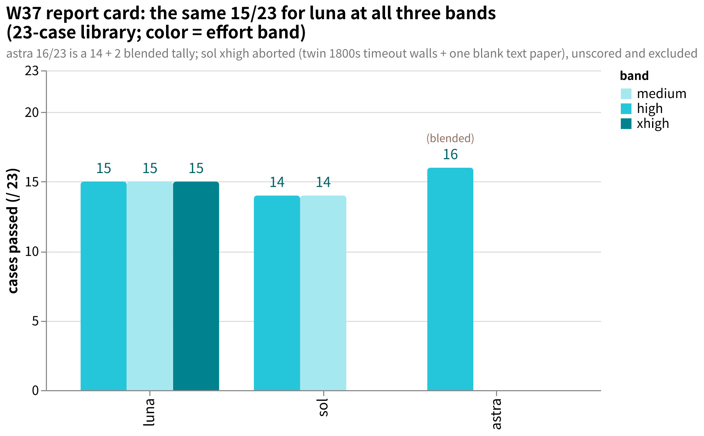
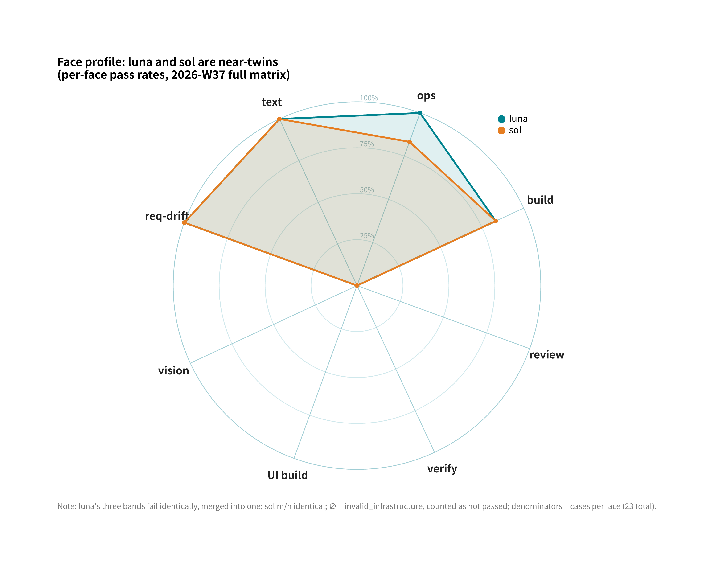
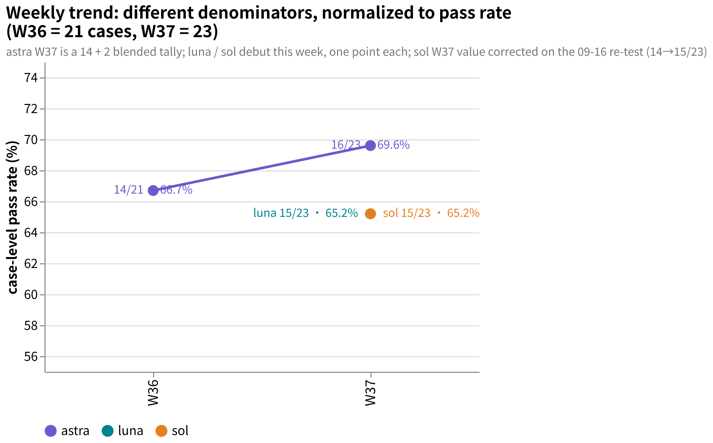
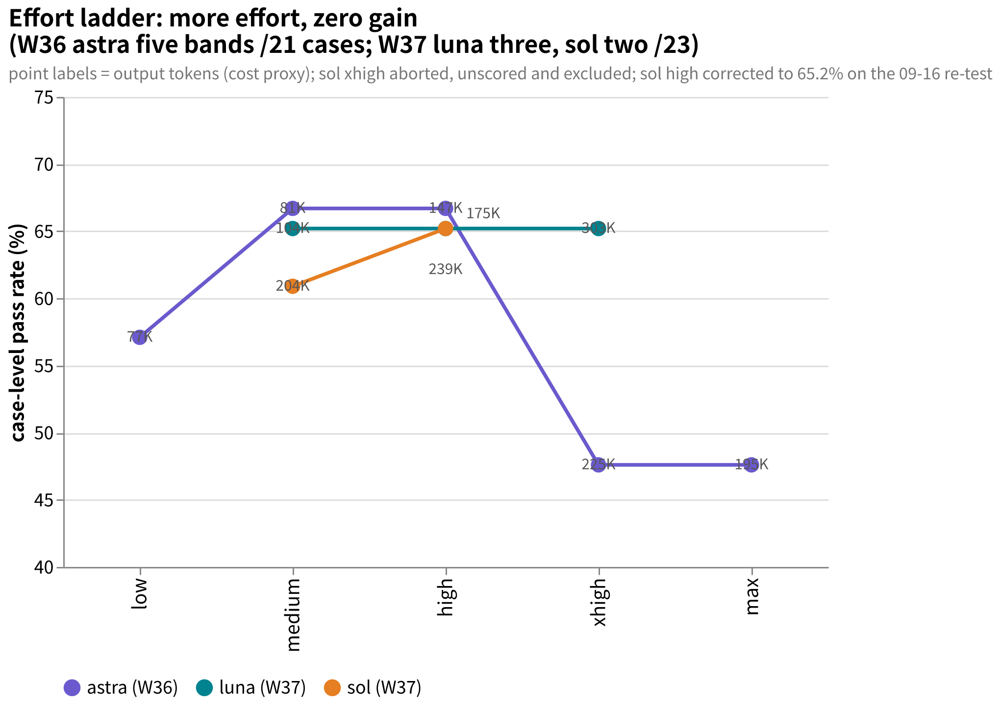

# amber-gpt

Weekly public benchmark results of GPT-family models (across reasoning-effort bands) on the private **AMBER** suite — cases private, results public.
中文： [README.md](README.md)

## What this is

- One issue per week at `results/YYYY-Www.md`: same cases, same harness, full library; the same model at different effort bands side by side.
- Every issue reports: case-set size and hashes, per-case d2 scores and pass/fail, terminal states, token usage and latency, environment fingerprint, and qualitative verdicts written under evidence discipline.
- Cases, oracles, transcripts, and intermediate artifacts are **never published** (see "Publication discipline").
- Sister repos: [amber-crof](https://github.com/getaskclaw/amber-crof) (CrofAI weekly), [amber-ollama](https://github.com/getaskclaw/amber-ollama) (Ollama Cloud weekly).
- The AMBER suite spec and case-authoring tools live at [getaskclaw/amber](https://github.com/getaskclaw/amber); the case contents themselves are private.

## Publication discipline (red lines)

1. Publish only: scores and aggregates, token usage, latency, qualitative verdicts.
2. Never publish: case content, oracles/graders, transcripts, candidate workspaces, or any intermediate artifact that could reconstruct a case.
3. Every issue pins: model ID, effort band, date (UTC), harness version, and per-case content hashes (bundle_sha). Hashes line up with the public hash manifest in [amber](https://github.com/getaskclaw/amber) so anyone can verify the case set has not changed.
4. Case IDs and case structure are private: public results refer to cases only by stable aliases (A-xxxxxxxx, hash-derived) plus bundle hashes; internal case IDs, variant names, and case descriptions never appear.
5. Tone: this is a community weekly measurement, not an attack on any vendor. Let the data talk; keep wording restrained.

## A methodological premise

The same model on the same provider can score differently across runs — serving versions, load, and parameters drift. Everything here carries a date and an effort band, and is re-measured weekly. A single day's number is a snapshot, not a law.

## Charts

- **Report card** (2026-W37, 23-case library): luna posts the same 15/23 at all three bands, sol 14/23 at two, astra 16/23 on a blended tally; sol xhigh aborted and excluded.
  
- **Face profile** (W37 full matrix, grouped by face): luna and sol nearly overlap; the only gap is ops (A-24bcf707).
  
- **Weekly trend** (W36 to W37, normalized to pass rate): astra 66.7% to 69.6% (W37 blended), luna 65.2% and sol 60.9% debut.
  
- **Effort ladder** (W36 astra five bands + W37 luna/sol): more effort, zero gain — up to 2.9x the tokens, same score.
  

## Results index

| Issue | Content | Verdict |
|---|---|---|
| [2026-W36](results/2026-W36.md) | gpt-6-astra-900k at five effort bands, full library | Non-monotonic: 12→14→14→10→10; medium is the sweet spot, xhigh/max backfire; zero delivery on the UI case at top bands |
| [2026-W37](results/2026-W37.md) | gpt-5.6-luna-900k at three bands + gpt-5.6-sol-900k at two (new 23-case library); astra makeup on bare base for the 2 new cases (addendum) | luna posts the same 15/23 with the same fail list at all three bands — effort buys nothing, xhigh is 2.9× tokens for the same card; no sol band beats luna; top-band backlash again at xhigh (timeout walls); astra passes both makeup cases → blended 16/23 (the -900k variant was revoked; blended tally noted). Addendum 2 (09-12): third luna-high run 15/23 (headline stable, fail set drifts ±2 across days); four-band re-sweep proves "none" = server-default medium (reasoning_tokens audit), effort-no-gain stands; new orchestration case low 21 > high 15, top-band backlash; sol re-run paused at 9/26, unscored |

## Disclaimer

Not affiliated with or sponsored by OpenAI. Scores are snapshots of a specific week and effort band — not procurement advice.
