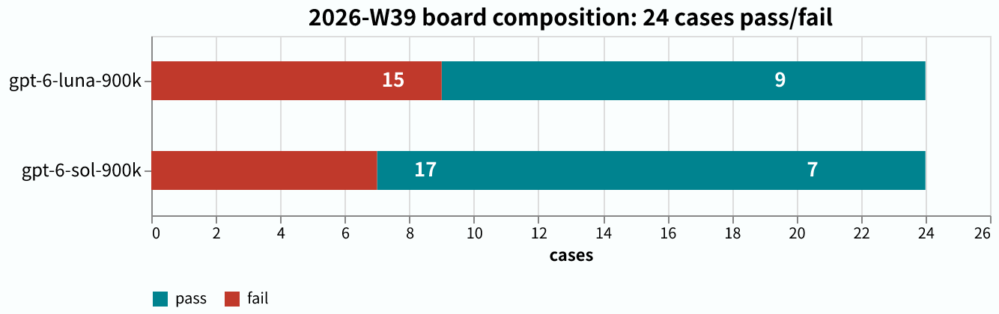
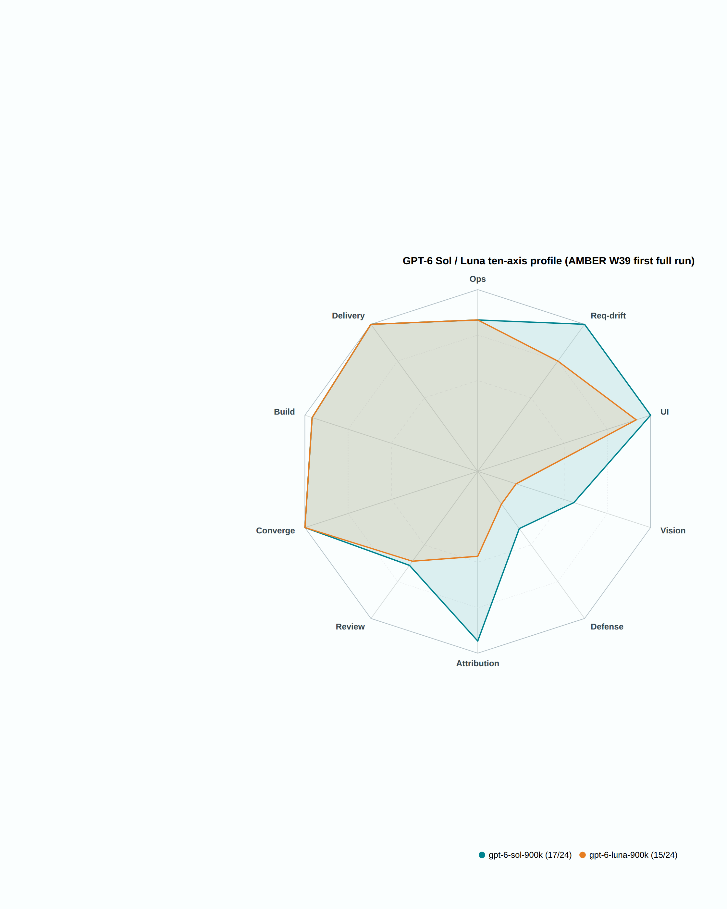

# amber-gpt

Weekly public benchmark results of GPT-family models (across reasoning-effort band (the thinking-effort setting)s) on the private **AMBER** suite — cases private, results public.
中文： [README.md](README.md)

## What this is

- A 'lane' is one vendor's shop/API for a model name; a 'case' is one task, a 'run' is one sitting (a multi-variant case has several runs).

- One issue per week at `results/YYYY-Www.md`: same cases, same harness (the program that runs the exam and scores it), full library; the same model at different effort bands side by side.
- Every issue reports: case-set size and hashes, per-case defect-hunt scores and pass/fail, terminal states (how the run process exited), token usage and latency, environment fingerprint, and qualitative verdicts written under evidence discipline.
- Cases, oracles, transcripts (full answer logs), and intermediate artifacts are **never published** (see "Publication discipline").
- Sister repos: [amber-crof](https://github.com/getaskclaw/amber-crof) (CrofAI weekly), [amber-ollama](https://github.com/getaskclaw/amber-ollama) (Ollama Cloud weekly), [amber-devin](https://github.com/getaskclaw/amber-devin) (Devin lane), [amber-deepseek](https://github.com/getaskclaw/amber-deepseek) (official DeepSeek lane), [amber-commandcode](https://github.com/getaskclaw/amber-commandcode) (CommandCode lane), [amber-opencode](https://github.com/getaskclaw/amber-opencode) (OpenCode Go lane), [amber-workbuddy](https://github.com/getaskclaw/amber-workbuddy) (WorkBuddy ACP lane), [amber-doubao](https://github.com/getaskclaw/amber-doubao), [amber-goldenpotato](https://github.com/getaskclaw/amber-goldenpotato), [amber-kimi](https://github.com/getaskclaw/amber-kimi), [amber-stepfun](https://github.com/getaskclaw/amber-stepfun).
- The AMBER suite spec and case-authoring tools live at [getaskclaw/amber](https://github.com/getaskclaw/amber); the case contents themselves are private.

## Publication discipline (red lines)

1. Publish only: scores and aggregates, token usage, latency, qualitative verdicts.
2. Never publish: case content, oracles/graders, transcripts, candidate workspaces, or any intermediate artifact that could reconstruct a case.
3. Every issue pins: model ID, effort band, date (UTC), harness version, and per-case content hashes (bundle_sha (per-case content-hash fingerprint)). Hashes line up with the public hash manifest in [amber](https://github.com/getaskclaw/amber) so anyone can verify the case set has not changed.
4. Case IDs and case structure are private: public results refer to cases only by stable aliases (A-xxxxxxxx, hash-derived) plus bundle hashes; internal case IDs, variant names, and case descriptions never appear.
5. Tone: this is a community weekly measurement, not an attack on any vendor. Let the data talk; keep wording restrained.

## A methodological premise

The same model on the same provider can score differently across runs — serving versions, load, and parameters drift. Everything here carries a date and an effort band, and is re-measured weekly. A single day's number is a snapshot, not a law.

## Charts

- **Report card** (2026-W39, 24-case library): first full run the day after the 6-series launch — gpt-6-sol-900k **17/24**, gpt-6-luna-900k **15/24**; sol ties the cross-repo leader (opus-5.5 17/24, see [amber-claude W39](https://github.com/getaskclaw/amber-claude/blob/main/results/2026-W39.md)), and the 5.6-era family pattern "luna ≥ sol" flips in the 6 series. See [W39](results/2026-W39.en.md).
  
- **Ten-axis profile** (2026-W39): the 6-series gains are on the judge faces (defect-hunt / attribution / review — axes about finding faults in others' work) — attribution 0.47→0.93, review 0.22→0.64 (vs the 5.6 predecessor; 0 = all wrong, 1 = perfect); vision remains the heirloom weakness (vision case score sol 1.0 / luna −2; ≥ 2 passes, neither does).
  
- **Report card** (2026-W37, 23-case library): luna posts the same 15/23 at all three bands, sol 14/23 at two (high band **corrected to 15/23** on the 09-16 re-test — the ui-build zero-delivery was a client-side watchdog kill, makeup 12/12; see [W38](results/2026-W38.md)), astra 16/23 on a blended tally; sol xhigh aborted and excluded.
  
- **Face profile** (W37 full matrix, grouped by face): luna and sol nearly overlap; the only gap is ops (A-24bcf707). Note: W37 snapshot — sol's ui-build cell was overturned on 09-16, see [W38](results/2026-W38.md).
  
- **Weekly trend** (W36 to W37, normalized to pass rate): astra 66.7% to 69.6% (W37 blended), luna 65.2% and sol 60.9% debut (sol corrected to 65.2% on the 09-16 re-test, see [W38](results/2026-W38.md)).
  
- **Effort ladder** (W36 astra five bands + W37 luna/sol): more effort, zero gain — up to 2.9x the tokens, same score. 09-17 update: luna's first max-band run posts 16/23 — apparently breaking the flatline, but the +1 is a watchdog-fix confound (adjusted: 15/23, tied with high, at 397K reasoning ≈ 2.6× high); zero-gain holds (chart predates the max point; see [W38 Addendum 4](results/2026-W38.md)).
  

## Results index

| Issue | Content | Verdict |
|---|---|---|
| [2026-W36](results/2026-W36.md) | gpt-6-astra-900k at five effort bands, full library | Non-monotonic: 12→14→14→10→10; medium is the sweet spot, xhigh/max backfire; zero delivery on the UI case at top bands |
| [2026-W37](results/2026-W37.md) | gpt-5.6-luna-900k at three bands + gpt-5.6-sol-900k at two (new 23-case library); astra makeup on bare base for the 2 new cases (addendum) | luna posts the same 15/23 with the same fail list at all three bands — effort buys nothing, xhigh is 2.9× tokens for the same card; no sol band beats luna; top-band backlash again at xhigh (timeout walls); astra passes both makeup cases → blended 16/23 (the -900k variant was revoked; blended tally noted). Addendum 2 (09-12): third luna-high run 15/23 (headline stable, fail set drifts ±2 across days); four-band re-sweep proves "none" = server-default medium (reasoning_tokens audit), effort-no-gain stands; new orchestration case low 21 > high 15, top-band backlash; sol re-run paused at 9/26, unscored. Addendum 3 (09-16): sol re-test overturns the ui-build cell → 15/23 |
| [2026-W38](results/2026-W38.md) | gpt-5.6-sol-900k @ high full-library drift re-test (vs W37) | zero capability drift — 22/23 identical pass/fail, hard discriminator still 7/7; the one change is the ui-build reversal (client-side watchdog kill, makeup 12/12 perfect) → **15/23**, fourth published lane with a perfect score on that case; luna's matching cell flagged suspected-wrongful, unmeasured; upstream hermes-agent#112909. Addendum 4 (09-17): luna's first **max**-band run scores **16/23**, the fullest luna band — but the +1 (first ui-build delivery, 12/12) is confounded with the 09-16 watchdog fix; confound-adjusted it is 15/23, tied with high, so "effort buys nothing" holds (397K reasoning ≈ 2.6× high); vision case 5.0 sets the all-time published best; attribution 14/15→7/15 replays the top-band backlash |
| [2026-W38 correction notice](results/2026-W38-correction.en.md) | W38 full-library review: 12 cells reversed · 14 held in this repo | Eight W36 astra max/xhigh cells exonerated (published marks to be flipped); 14 W37 luna/sol cells held; 1 W38 Add4 cell + 3 sol re-test cells exonerated |
| [2026-W39](results/2026-W39.en.md) | gpt-6-sol-900k + gpt-6-luna-900k @ high, first full run (24 cases, day after the 6-series launch) | sol **17/24** ties the cross-repo leader opus-5.5; luna 15/24; the "luna ≥ sol" family pattern flips in the 6 series; gains on the judge faces (attribution 0.47→0.93, review 0.22→0.64), vision still the weakness (1.0 / −2, both below the line); harness now hard-fails on brain mismatch |

## Disclaimer

Not affiliated with or sponsored by OpenAI. Scores are snapshots of a specific week and effort band — not procurement advice.
