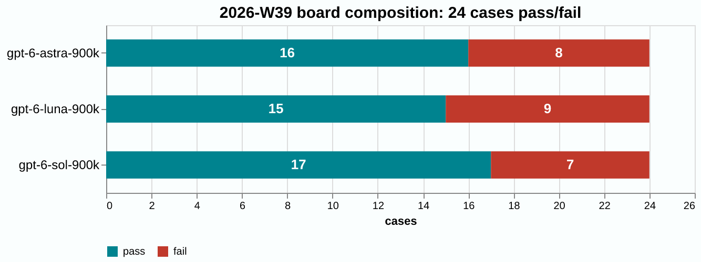
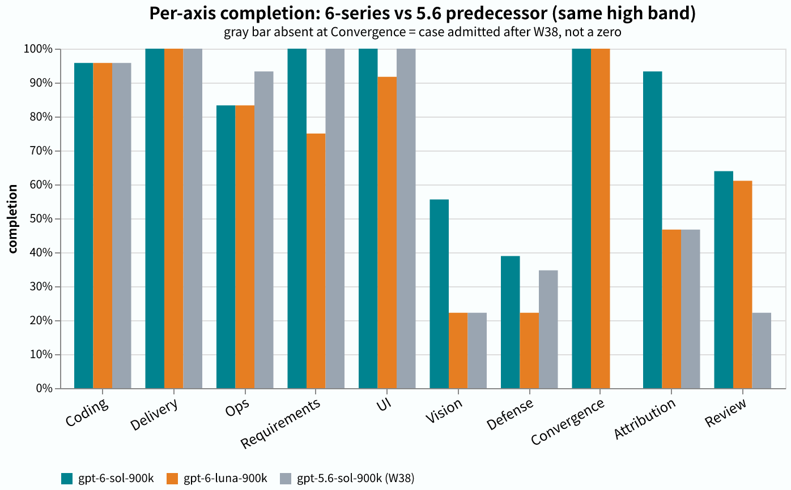
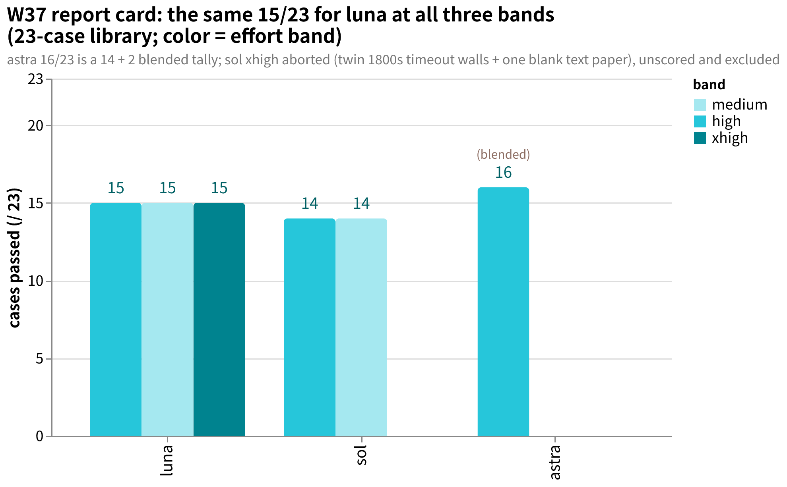
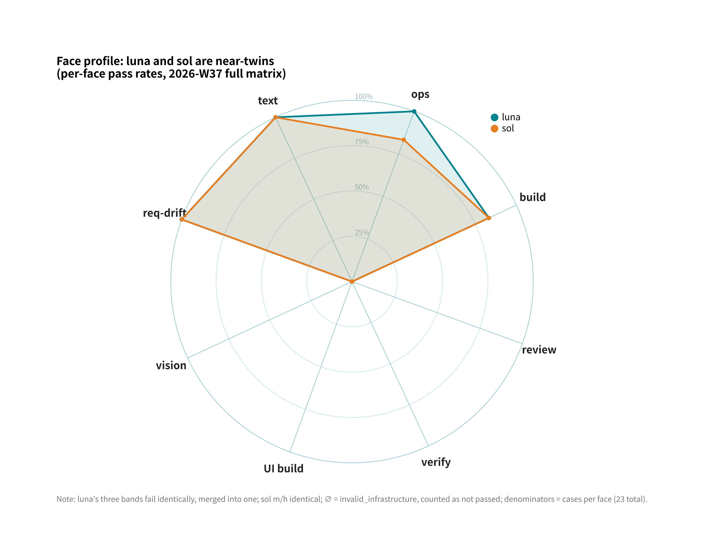
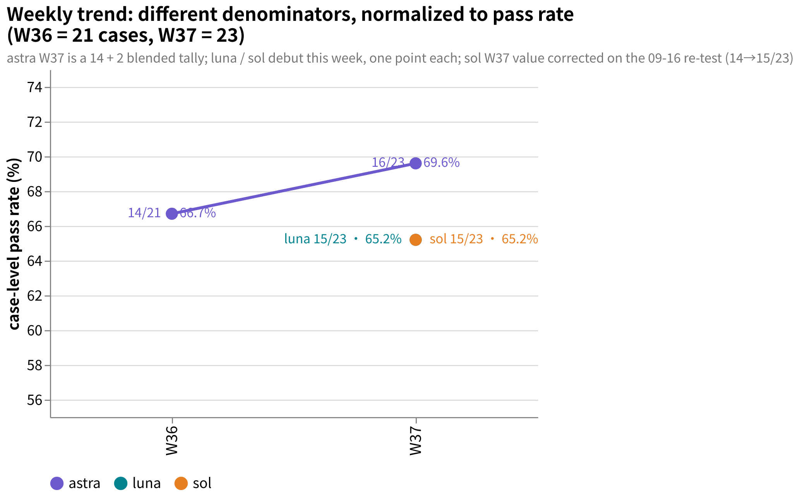
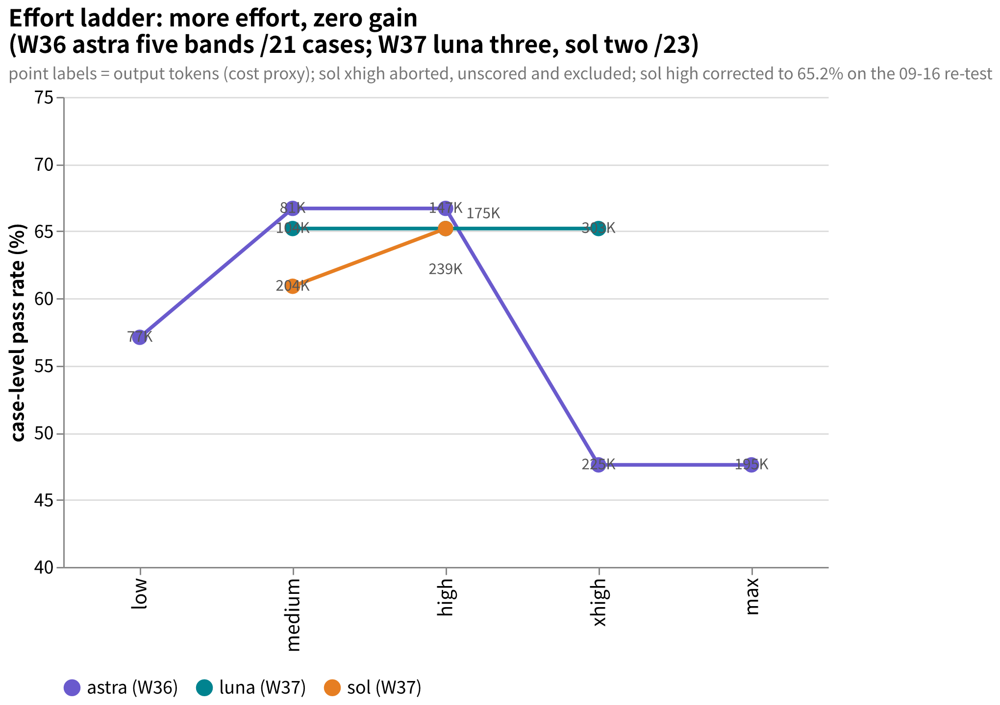

[简体中文](README.md) · English

# amber-gpt

> **Update 2026-10-07 (third)**: A-cdc3d11a (review): on one review case the grader counted every sub-point of a well-formed finding as a separate unproven claim and treated real defects outside its short answer list as false alarms, so a correct, well-formatted review could not reach the passing line; the case is held (NA) on every lane, the denominator stays 24, until the grader and exam room are repaired and the case is re-sat. Total passes are unchanged; the case moves from a loss to NA on 27 lanes; no sitting was re-run, and no conclusion is drawn about any model's ability. See the amber spec repo correction of 2026-10-07 (A-cdc3d11a) ([link](https://github.com/getaskclaw/amber/blob/main/docs/corrections-2026-10-07-a-cdc3d11a.en.md)). Lanes affected in this repo: gpt-6-astra-900k and gpt-6-sol-900k (W39), gpt-6.1-sol (W40), gpt-5.6-luna, gpt-5.6-luna-900k, gpt-6-luna and gpt-6-luna-900k (W41); for gpt-5.6-luna-900k (high band, W37) and gpt-5.6-sol-900k (high band, W38) the case was already NA, and the label is now "held". Every affected lane's review cell in the scoreboard gains one NA (and the ops cell of the lanes that also carry the A-24bcf707 hold), and no lane's total changes; phrases such as "nothing on hold", "two ops cases lost", "the only NA in each" and "review passes one case" in the summaries and the index below are to be read accordingly. Per-issue details are in the updates at the top of [W39](results/2026-W39.en.md), [W40](results/2026-W40.en.md) and [W41](results/2026-W41.en.md).

> **Update 2026-10-07 (second)**: A-24bcf707: the grader required the named removal commit to have deleted lines inside the feature's own files; the prompt asks for the commit where the feature was removed or lost and does not say that requirement. The lanes that failed only that check are recorded NA (held) instead of a loss; total passes are unchanged. See the amber spec repo correction of 2026-10-07 ([link](https://github.com/getaskclaw/amber/blob/main/docs/corrections-2026-10-07-a-24bcf707.en.md)). Lanes affected: gpt-6-astra-900k and gpt-6-sol-900k (W39), gpt-6.1-sol (W40), gpt-6-luna and gpt-6-luna-900k (W41): the ops row of the scoreboard is updated (one more NA in the ops cell), and no lane's total changes; phrases such as "nothing on hold", "two ops cases lost" and "the only NA in each" in the summaries and the index below are to be read to fit. Per-issue details are in the updates at the top of [W39](results/2026-W39.en.md), [W40](results/2026-W40.en.md) and [W41](results/2026-W41.en.md).

> ⚠️ **Correction (2026-10-02, second)**: one defense case, A-d511f9e8, is now NA on every lane (the exam room did not grade the file the model gave in, and the grader asks for something the task text does not say). The denominator and the **number of passed cases do not change**; every lane's total now carries `'`. In this repo's issue tables, read that cell as NA. Everything else stays as published; the [correction notice](https://github.com/getaskclaw/amber/blob/main/docs/corrections-2026-10-02-a-d511f9e8.en.md) governs.

> Correction for 5.6-luna: W37 high base plus W39 high make-up; 16'/24 = 16 wins · 4 losses · 4 held. First public word of three exonerated_infra rulings, capability scores withheld; A-ea80d793 stays held. [Details](results/2026-W38-correction-luna-high.en.md). This does not change GPT-6 results. ' = contested (held for safety refusal) or invalid (infrastructure-related (test harness or scoring environment) cases: held, void or awaiting re-scoring); neither counts as a win or a loss. Every lane with NA carries an apostrophe, including frozen display rows; a hold does not settle the cause.

> **Update 2026-10-07**: the Charts entry for the W39 per-axis head-to-head below says "≥ 2 passes" for the vision case. That is an inexact short form: the vision case is not decided by the fault-finding score alone, and the same score of 2 can pass in one sitting and fail in another. The old sentence is kept as it is; see the 2026-10-07 updates at the top of the [W39](results/2026-W39.en.md) and [W40](results/2026-W40.en.md) pages.

Weekly public benchmark results of GPT-family models (across reasoning-effort band (the thinking-effort setting)s) on the private **AMBER** suite — cases private, results public.

## Scoreboard

<!-- scoreboard:start -->

| Group | Axis | What it tests | gpt-5.6-luna · [W41](results/2026-W41.en.md) | gpt-5.6-luna-900k · [W41](results/2026-W41.en.md) | gpt-6-luna · [W41](results/2026-W41.en.md) | gpt-6-luna-900k · [W41](results/2026-W41.en.md) | gpt-6.1-sol · [W40](results/2026-W40.en.md) | gpt-6-sol-900k · [W39](results/2026-W39.en.md) | gpt-6-astra-900k · [W39](results/2026-W39.en.md) | gpt-5.6-sol-900k (high band) · [W38](results/2026-W38.md) | gpt-5.6-luna-900k (high band) · [W37](results/2026-W37.md) |
|---|---|---|:-:|:-:|:-:|:-:|:-:|:-:|:-:|:-:|:-:|
| Building | Coding | Implement the spec correctly | 5/6 | 5/6 | 5/6 | 5/6 | 5/6 | 5/6 | 5/6 | 5/6 | 5/6 |
|  | Delivery | Done means handed in | 3/3 | 3/3 | 3/3 | 3/3 | 3/3 | 3/3 | 2/3 | 3/3 | 3/3 |
|  | Ops | Follow the runbook | 5/6 | 5/6 | 5/6 · 1 NA | 5/6 · 1 NA | 4/6 · 1 NA | 5/6 · 1 NA | 5/6 · 1 NA | 5/6 | 6/6 |
|  | Requirements | Ship A when A was asked | 1/1 | 0/1 | 0/1 | 0/1 | 1/1 | 1/1 | 1/1 | 1/1 | 1/1 |
|  | Convergence | Finish, don't spin | 1/1 | 1/1 | 1/1 | 1/1 | 1/1 | 1/1 | 1/1 | — | 1/1 |
| Judging | UI | Build the page to the mock | 1/1 | 1/1 | 1/1 | 0/1 | 1/1 | 1/1 | 0/1 | 1/1 | 0/1 · 1 NA |
|  | Vision | Spot defects in screenshots | 0/1 | 0/1 | 0/1 | 0/1 | 0/1 | 0/1 | 1/1 | 0/1 · 1 NA | 0/1 · 1 NA |
|  | Defense | Plug every hole in the validator | 0/2 · 1 NA | 0/2 · 1 NA | 0/2 · 1 NA | 0/2 · 1 NA | 0/2 · 1 NA | 0/2 · 1 NA | 0/2 · 1 NA | 0/2 · 1 NA | 0/2 · 1 NA |
|  | Attribution | Pin defects to their root cause | 0/1 | 0/1 | 0/1 | 0/1 | 0/1 | 0/1 | 0/1 | 0/1 | 0/1 |
|  | Review | Inspect someone else's work | 1/2 · 1 NA | 1/2 · 1 NA | 1/2 · 1 NA | 1/2 · 1 NA | 1/2 · 1 NA | 1/2 · 1 NA | 1/2 · 1 NA | 0/2 · 2 NA | 0/2 · 2 NA |
|  | **Total** |  | **17'/24** | **16'/24** | **16'/24** | **15'/24** | **16'/24** | **17'/24** | **16'/24** | **15'/23** | **16'/24** |

Each cell = cases passed / cases on that axis (a case is one scored task). NA = the case was voided or put on hold; it counts as neither a pass nor a fail, and a total carrying `'` has at least one NA. Most axes hold only 1–2 cases, so one case moves the reading: do not over-read small gaps. Sittings are from different weeks; every number is a snapshot.

<!-- scoreboard:end -->

## What this is

- A 'lane' is one vendor's shop/API for a model name; a 'case' is one task, a 'run' is one sitting (a case with more than one variant has more runs).
- One issue per week at `results/YYYY-Www.md`: same cases, same harness (the program that runs the exam and scores it), full library; the same model at different effort bands side by side.
- Every issue reports: case-set size and hashes, per-case defect-hunt scores and pass/fail, terminal states (how the run ended), token usage and latency, environment fingerprint, and verdicts written under evidence rules.
- Cases, oracles, transcripts (full answer logs), and intermediate artifacts are **never published** (see "Publication rules").
- Sister repos: [amber-crof](https://github.com/getaskclaw/amber-crof) (CrofAI weekly), [amber-ollama](https://github.com/getaskclaw/amber-ollama) (Ollama Cloud weekly), [amber-devin](https://github.com/getaskclaw/amber-devin) (Devin lane), [amber-deepseek](https://github.com/getaskclaw/amber-deepseek) (official DeepSeek lane), [amber-commandcode](https://github.com/getaskclaw/amber-commandcode) (CommandCode lane), [amber-opencode](https://github.com/getaskclaw/amber-opencode) (OpenCode Go lane), [amber-workbuddy](https://github.com/getaskclaw/amber-workbuddy) (WorkBuddy ACP lane), [amber-doubao](https://github.com/getaskclaw/amber-doubao), [amber-goldenpotato](https://github.com/getaskclaw/amber-goldenpotato), [amber-kimi](https://github.com/getaskclaw/amber-kimi), [amber-stepfun](https://github.com/getaskclaw/amber-stepfun), [amber-claude](https://github.com/getaskclaw/amber-claude) (Claude lane: claude-opus-5-5, claude-sonnet-5-5 and claude-fable-5-1).
- The AMBER suite spec and case-authoring tools live at [getaskclaw/amber](https://github.com/getaskclaw/amber); the case contents themselves are private.

## Publication rules (red lines)

1. Publish only: scores and totals, token usage, latency, verdicts.
2. Never publish: case content, oracles/graders, transcripts, candidate workspaces, or any intermediate artifact that could rebuild a case.
3. Every issue pins: model ID, effort band, date (UTC), harness version, and per-case content hashes (bundle_sha (per-case content-hash fingerprint)). Hashes line up with the public hash manifest in [amber](https://github.com/getaskclaw/amber) so anyone can check the case set has not changed.
4. Case IDs and case structure are private: public results refer to cases only by stable aliases (A-xxxxxxxx, hash-derived) plus bundle hashes; internal case IDs, variant names, and case descriptions never appear.
5. Tone: this is a community weekly measurement, not an attack on any vendor. Let the data talk; keep wording simple.

## A methods note

The same model on the same provider can score differently across runs — serving versions, load, and parameters drift. Everything here carries a date and an effort band, and is re-measured weekly. A single day's number is a snapshot, not a law.

## Charts

- **Report card** (2026-W41, 24-case library): four luna models took the full library one after another in the same isolated room (2026-10-06, high band, serial) — gpt-5.6-luna **17'/24**, gpt-5.6-luna-900k **16'/24**, gpt-6-luna **16'/24**, gpt-6-luna-900k **15'/24** (the second sitting of that lane, now its headline); the only NA in each is A-d511f9e8. Of the 24 cases, 20 have the same win or loss on all four; no passes on vision, defense or attribution on any of them; gpt-6-luna-900k is missing one required file on the UI case, counted as a loss. Close totals are one case apart, each taken once, so this does not show who is stronger or weaker. See [W41](results/2026-W41.en.md).
  
- **Report card** (2026-W40, 24-case library): gpt-6.1-sol, first full-library test, **16'/24** with nothing on hold apart from A-d511f9e8. Only one case has a different win or loss from the older gpt-6-sol-900k (W39, 17'/24): ops case A-8c909d0a. The context windows also differ (272K against 900K), so read the two side by side; this does not show that one is stronger or weaker. No passes on vision, defense or attribution; review passes one case. See [W40](results/2026-W40.en.md).
  
- **Report card** (2026-W39, 24-case library): first full run the day after the 6-series launch — gpt-6-sol-900k **17/24**, gpt-6-astra-900k **16/24** (same-day control), gpt-6-luna-900k **15/24**; sol ties the cross-repo leader (opus-5.5: 17 wins · 6 losses · 1 case void due to infrastructure; see its correction, see [amber-claude W39](https://github.com/getaskclaw/amber-claude/blob/main/results/2026-W39-correction.en.md)), and the 5.6-era family pattern "luna ≥ sol" flips in the 6 series. See [W39](results/2026-W39.en.md).
  
- **Per-axis head-to-head** (2026-W39): the three 6-series siblings same-day plus the 5.6 model before them side by side — gains on the judge faces (defect-hunt / attribution / review — axes about finding faults in others' work): attribution 0.47→0.93, review 0.22→0.64 (vs the 5.6 model before them; 0 = all wrong, 1 = perfect); vision remains the long-running weakness (vision case score sol 1.0 / luna −2; ≥ 2 passes, neither does).
  
- **Report card** (2026-W37, 23-case library): luna posts the same 15/23 at all three bands, sol 14/23 at two (high band **corrected to 15/23** on the 09-16 re-test — the ui-build zero-delivery was a client-side watchdog kill, makeup 12/12; see [W38](results/2026-W38.md)), astra 16/23 on a blended tally; sol xhigh aborted and excluded.
  
- **Face profile** (W37 full matrix, grouped by face): luna and sol nearly overlap; the only gap is ops (A-24bcf707). Note: W37 snapshot — sol's ui-build cell was overturned on 09-16, see [W38](results/2026-W38.md).
  
- **Weekly trend** (W36 to W37, normalized to pass rate): astra 66.7% to 69.6% (W37 blended), luna 65.2% and sol 60.9% debut (sol corrected to 65.2% on the 09-16 re-test, see [W38](results/2026-W38.md)).
  
- **Effort ladder** (W36 astra five bands + W37 luna/sol): more effort, zero gain — up to 2.9x the tokens, same score. 09-17 update: luna's first max-band run posts 16/23 — it looks like the flatline breaks, but the +1 is mixed up with a watchdog fix (adjusted: 15/23, tied with high, at 397K reasoning ≈ 2.6× high); zero-gain holds (chart predates the max point; see [W38 Addendum 4](results/2026-W38.md)).
  

## Results index

| Issue | Content | Verdict |
|---|---|---|
| [2026-W36](results/2026-W36.md) | gpt-6-astra-900k at five effort bands, full library | Not a one-way rise: 12→14→14→10→10; medium is the sweet spot, xhigh/max backfire; zero delivery on the UI case at top bands |
| [2026-W37](results/2026-W37.md) | gpt-5.6-luna-900k at three bands + gpt-5.6-sol-900k at two (new 23-case library); astra makeup on bare base for the 2 new cases (addendum) | luna posts the same 15/23 with the same fail list at all three bands — effort buys nothing, xhigh is 2.9× tokens for the same card; no sol band beats luna; top-band backlash again at xhigh (timeout walls); astra passes both makeup cases → blended 16/23 (the -900k variant was revoked; blended tally noted). Addendum 2 (09-12): third luna-high run 15/23 (headline stable, fail set drifts ±2 across days); four-band re-sweep proves "none" = server-default medium (reasoning_tokens audit), effort-no-gain stands; new orchestration case low 21 > high 15, top-band backlash; sol re-run paused at 9/26, unscored. Addendum 3 (09-16): sol re-test overturns the ui-build cell → 15/23 |
| [2026-W38](results/2026-W38.md) | gpt-5.6-sol-900k @ high full-library drift re-test (vs W37) | zero capability drift — 22/23 identical pass/fail, hard discriminator still 7/7; the one change is the ui-build reversal (client-side watchdog kill, makeup 12/12 perfect) → **15/23**, fourth published lane with a perfect score on that case; luna's matching cell flagged suspected-wrongful, unmeasured; upstream hermes-agent#112909. Addendum 4 (09-17): luna's first **max**-band run scores **16/23**, the fullest luna band — but the +1 (first ui-build delivery, 12/12) is mixed up with the 09-16 watchdog fix; setting that apart it is 15/23, tied with high, so "effort buys nothing" holds (397K reasoning ≈ 2.6× high); vision case 5.0 sets the all-time published best; attribution 14/15→7/15 replays the top-band backlash |
| [2026-W38 correction notice](results/2026-W38-correction.en.md) | W38 full-library review: 12 cells reversed · 14 held in this repo | Eight W36 astra max/xhigh cells cleared (published marks to be flipped); 14 W37 luna/sol cells held; 1 W38 Add4 cell + 3 sol re-test cells cleared |
| [5.6-luna high display correction](results/2026-W38-correction-luna-high.en.md) | W37 high base 2026-09-07 + W39 high make-up 2026-09-21 | 16'/24: 16 wins · 4 losses · 4 held; UI / Vision / Review NA; high only, not max |
| [2026-W39](results/2026-W39.en.md) | gpt-6-sol-900k + gpt-6-luna-900k @ high first full run + gpt-6-astra-900k same-day control (24 cases, day after the 6-series launch) | sol **17/24** ties the cross-repo leader opus-5.5; astra same-day control 16/24 (double-run pair, zero flips); luna 15/24; the "luna ≥ sol" family pattern flips in the 6 series; gains on the judge faces (attribution 0.47→0.93, review 0.22→0.64), vision still the weakness (1.0 / −2, both below the line); harness now hard-fails on brain mismatch |
| [2026-W40](results/2026-W40.en.md) | gpt-6.1-sol @ high first full run (24 cases, 2026-10-02) | **16'/24** with nothing on hold apart from A-d511f9e8; only ops case A-8c909d0a has a different win or loss from gpt-6-sol-900k (W39, 17'/24), and the windows differ (272K against 900K), so read them side by side, not as stronger or weaker; no passes on vision, defense or attribution, review passes one case; image v2 adds PyYAML, and the paper gate is off for the brand case only |
| [2026-W41](results/2026-W41.en.md) | gpt-5.6-luna, gpt-5.6-luna-900k, gpt-6-luna, gpt-6-luna-900k @ high full run (24 cases, 2026-10-06, isolated room, serial) | **17'/24, 16'/24, 16'/24, 15'/24**, the only NA in each is A-d511f9e8; the first three are new lanes, gpt-6-luna-900k is the second sitting of an existing lane (first: W39, different room, not compared cell by cell); of the 24 cases 20 have the same win or loss on all four, no passes on vision, defense or attribution; gpt-6-luna-900k is missing one required file on the UI case; the scoreboard also has an older row `gpt-5.6-luna-900k (high 档)` (the W37 baseline), which is not the same lane as the new one in this issue; close totals are one case apart, each taken once, so no ranking of strength |

## Disclaimer

Not affiliated with or sponsored by OpenAI. Scores are snapshots of a specific week and effort band — not buying advice.