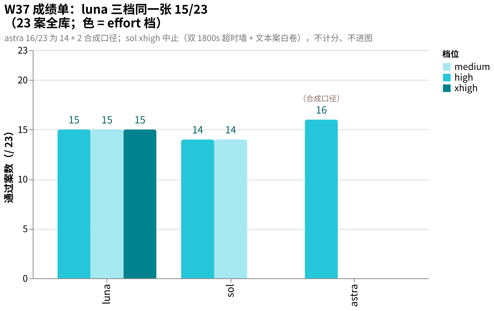
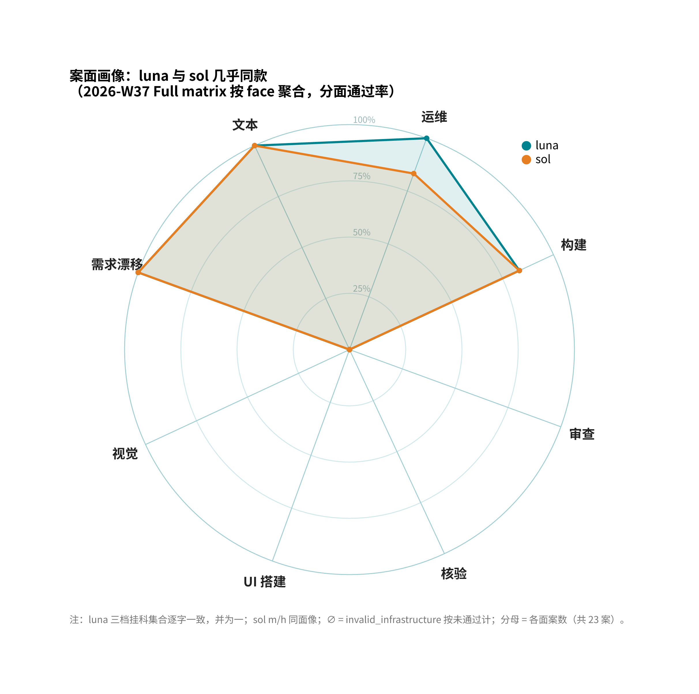
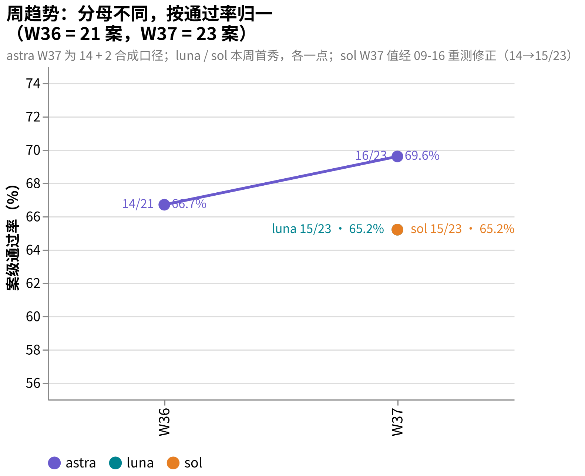
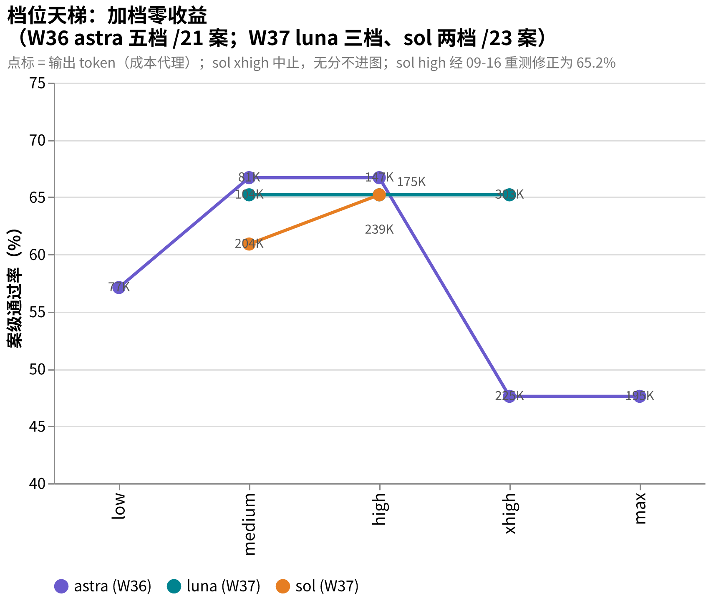

# amber-gpt

用私有题库 **AMBER** 每周实测 GPT 系模型（含不同推理档位），只公开结果，不公开题目。
English: [README.en.md](README.en.md)

## 这是什么

- 每周一期 `results/YYYY-Www.md`：同题、同 harness，对目标模型跑全库；同模型不同 effort 档位并排。
- 一期固定报告：题集规模与哈希、每案 d2 分与通过/失败、终端终态、token 用量与时延、环境指纹、按证据纪律写的定性裁决。
- 题目、oracle、transcript、中间产物**永不公开**（见下「发布纪律」）。
- 姐妹仓：[amber-crof](https://github.com/getaskclaw/amber-crof)（CrofAI 周测）、[amber-ollama](https://github.com/getaskclaw/amber-ollama)（Ollama Cloud 周测）、[amber-workbuddy](https://github.com/getaskclaw/amber-workbuddy)（WorkBuddy ACP 道）。
- AMBER 是 agentic 实战题库（施工/运维/审查/视觉/需求漂移），规范与制题工具见 [getaskclaw/amber](https://github.com/getaskclaw/amber)；考题本体私有。

## 发布纪律（红线）

1. 只发：分数与聚合、token 用量、速度、定性裁决。
2. 永不发：题目内容、oracle/判分器、transcript、考生工作区、任何能复原题面的中间产物。
3. 每期必钉：模型 ID、effort 档、日期（UTC）、harness 版本、每案内容哈希（bundle_sha）。哈希用于对照 [amber](https://github.com/getaskclaw/amber) 的公开哈希清单，自证题集未变。
4. 案号与题目结构属私有面：公开结果里案例只用稳定别名（A-xxxxxxxx，哈希派生）+ bundle 哈希作句柄；内部案号、变体名、题目描述永不出现。
5. 基调：这是社区周测，不是对厂商的攻击。数据说话，措辞克制。

## 一个方法论前提

同名模型、同 provider，两次跑也可能不同分——推理参数、负载、服务端版本都在漂。所以这里的一切结论都带日期与档位，且按周重测。单日数字是快照，不是定律。

## 图说数据

- **本期成绩单**（2026-W37，23 案全库）：luna 三档同一张 15/23，sol 两档 14/23，astra 合成口径 16/23；sol xhigh 中止不进图。
  
- **案面画像**（2026-W37 Full matrix 按 face 聚合）：luna 与 sol 分面通过率几乎重合，唯一差在运维面（A-24bcf707）。
  
- **周趋势**（W36→W37，按通过率 % 归一）：astra 66.7%→69.6%（W37 为合成口径），luna 65.2%、sol 60.9% 本周首秀。
  
- **档位天梯**（W36 astra 五档 + W37 luna/sol）：加档零收益——token 最多涨到 2.9 倍，分数不动。
  

## 结果索引

| 期 | 内容 | 结论 |
|---|---|---|
| [2026-W36](results/2026-W36.md) | gpt-6-astra-900k 五档（low→max）全库 | 不单调：12→14→14→10→10;medium 是甜点，xhigh/max 反噬；顶档 UI 案零交付 |
| [2026-W37](results/2026-W37.md) | gpt-5.6-luna-900k 三档 + gpt-5.6-sol-900k 两档（23 案新库）；astra 裸 base 补考 2 新案（addendum） | luna 三档同分同名单（15/23），effort 零收益，xhigh=2.9x 纯浪费；sol 无一档赢 luna;xhigh 超时墙再现顶档反噬；astra 补考全过→合成 16/23（-900k 变体已被收回，口径混合已标注） |

## 免责

与 OpenAI 无任何隶属/赞助关系。分数是特定周、特定档位的快照，不构成采购建议。
