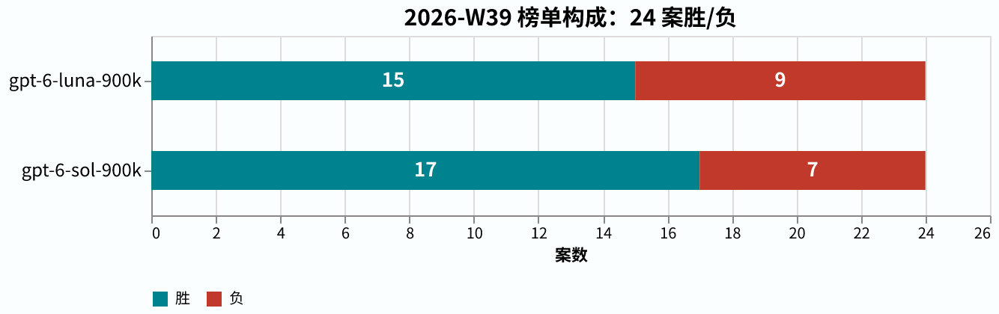
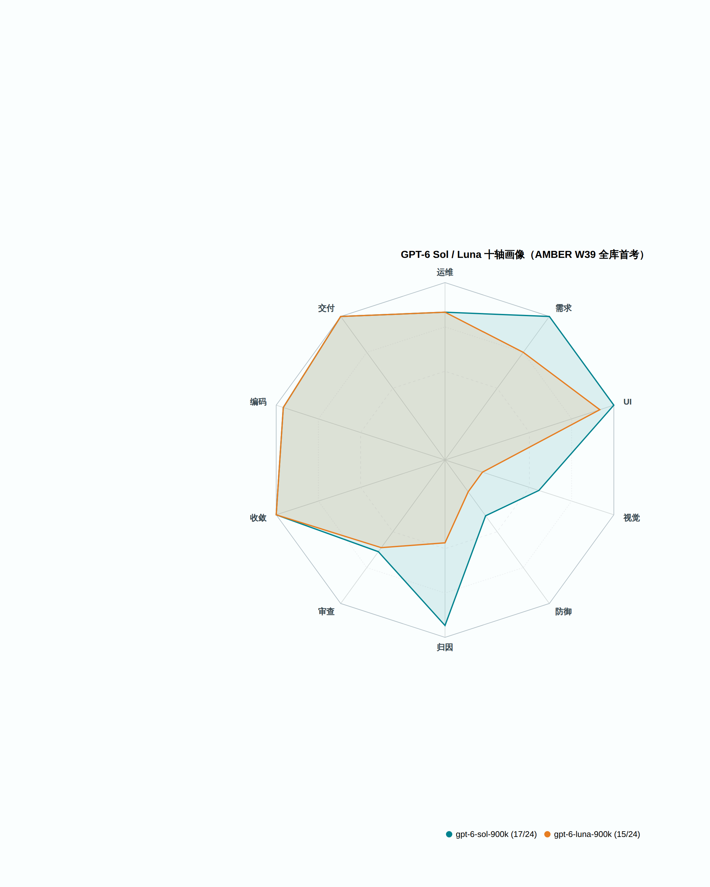

# amber-gpt

用私有题库 **AMBER** 每周实测 GPT 系模型（含不同推理档位），只公开结果，不公开题目。
English: [README.en.md](README.en.md)

## 这是什么

- 「道」= 同一个模型名在不同家的卖场/接口；「案」= 一道题，「卷」= 一场考试记录（一案多卷 = 一道题的几个变体场次）。

- 每周一期 `results/YYYY-Www.md`：同题、同 harness（跑考试并记分的程序），对目标模型跑全库；同模型不同 effort 档（思考力度档位）位并排。
- 一期固定报告：题集规模与哈希、每案找茬分（d2 分，我们的打分，算法不公开）与通过/失败、终端终态（程序跑完时的退出状态）、token 用量与时延、环境指纹、按证据纪律写的定性裁决。
- 题目、oracle（判分器）、transcript（答题全过程记录）、中间产物**永不公开**（见下「发布纪律」）。
- 姐妹仓：[amber-crof](https://github.com/getaskclaw/amber-crof)（CrofAI 周测）、[amber-ollama](https://github.com/getaskclaw/amber-ollama)（Ollama Cloud 周测）、[amber-devin](https://github.com/getaskclaw/amber-devin)（Devin 周测）、[amber-deepseek](https://github.com/getaskclaw/amber-deepseek)（DeepSeek 官方道）、[amber-commandcode](https://github.com/getaskclaw/amber-commandcode)（CommandCode 道）、[amber-opencode](https://github.com/getaskclaw/amber-opencode)（OpenCode Go 道）、[amber-workbuddy](https://github.com/getaskclaw/amber-workbuddy)（WorkBuddy ACP 道）、[amber-doubao](https://github.com/getaskclaw/amber-doubao)、[amber-goldenpotato](https://github.com/getaskclaw/amber-goldenpotato)、[amber-kimi](https://github.com/getaskclaw/amber-kimi)、[amber-stepfun](https://github.com/getaskclaw/amber-stepfun)。
- AMBER 是 agentic 实战题库（施工/运维/审查/视觉/需求漂移——题中要求中途变化），规范与制题工具见 [getaskclaw/amber](https://github.com/getaskclaw/amber)；考题本体私有。

## 发布纪律（红线）

1. 只发：分数与聚合、token 用量、速度、定性裁决。
2. 永不发：题目内容、oracle/判分器、transcript、考生工作区、任何能复原题面的中间产物。
3. 每期必钉：模型 ID、effort 档、日期（UTC）、harness 版本、每案内容哈希（bundle_sha，每题内容的哈希指纹）。哈希用于对照 [amber](https://github.com/getaskclaw/amber) 的公开哈希清单，自证题集未变。
4. 案号与题目结构属私有面：公开结果里案例只用稳定别名（A-xxxxxxxx，哈希派生）+ bundle 哈希作句柄；内部案号、变体名、题目描述永不出现。
5. 基调：这是社区周测，不是对厂商的攻击。数据说话，措辞克制。

## 一个方法论前提

同名模型、同 provider，两次跑也可能不同分——推理参数、负载、服务端版本都在漂。所以这里的一切结论都带日期与档位，且按周重测。单日数字是快照，不是定律。

## 图说数据

- **本期成绩单**（2026-W39，24 案全库）：6 系首发日次日全库首考——gpt-6-sol-900k **17/24**、gpt-6-luna-900k **15/24**；sol 追平跨仓榜首（opus-5.5 17/24，见 [amber-claude W39](https://github.com/getaskclaw/amber-claude/blob/main/results/2026-W39.md)），5.6 时代「luna ≥ sol」的家族规律在 6 系翻转。详见 [W39](results/2026-W39.md)。
  
- **十轴画像**（2026-W39）：6 系的收益在「判官」面（找茬/归因/审查这类挑别人毛病的轴）——归因 0.47→0.93、审查 0.22→0.64（对照 5.6 前辈，0=全错、1=满分）；视觉轴仍是祖传短板（视觉案打分 sol 1.0 / luna −2，≥2 才算过线，两家都没过）。
  
- **本期成绩单**（2026-W37，23 案全库）：luna 三档同一张 15/23，sol 两档 14/23（high 档 09-16 重测平反 UI 案 → **15/23**，见 [W38](results/2026-W38.md)），astra 合成口径 16/23；sol xhigh 中止不进图。
  
- **案面画像**（2026-W37 Full matrix 按 face 聚合）：luna 与 sol 分面通过率几乎重合，唯一差在运维面（A-24bcf707）。注：图为 W37 快照——sol 的 UI 案 09-16 平反，见 [W38](results/2026-W38.md)。
  
- **周趋势**（W36→W37，按通过率 % 归一）：astra 66.7%→69.6%（W37 为合成口径），luna 65.2%、sol 60.9% 本周首秀（sol 09-16 重测修正 65.2%，见 [W38](results/2026-W38.md)）。
  
- **档位天梯**（W36 astra 五档 + W37 luna/sol）：加档零收益——token 最多涨到 2.9 倍，分数不动。09-17 补：luna max 档首考 16/23 看似破平，实为看门狗修复混杂（剔除后 15/23 与 high 打平，reasoning 397K ≈ high 2.6 倍），零收益结论成立（图未含 max 点，见 [W38 Addendum 4](results/2026-W38.md)）。
  

## 结果索引

| 期 | 内容 | 结论 |
|---|---|---|
| [2026-W36](results/2026-W36.md) | gpt-6-astra-900k 五档（low→max）全库 | 不单调：12→14→14→10→10;medium 是甜点，xhigh/max 反噬；顶档 UI 案零交付 |
| [2026-W37](results/2026-W37.md) | gpt-5.6-luna-900k 三档 + gpt-5.6-sol-900k 两档（23 案新库）；astra 裸 base 补考 2 新案（addendum） | luna 三档同分同名单（15/23），effort 零收益，xhigh=2.9x 纯浪费；sol 无一档赢 luna;xhigh 超时墙再现顶档反噬；astra 补考全过→合成 16/23（-900k 变体已被收回，口径混合已标注）。Addendum 3（09-16）：sol 重测平反 UI 案 → 15/23 |
| [2026-W38](results/2026-W38.md) | gpt-5.6-sol-900k @ high 全库降智复测（对拍 W37） | 零能力回退：22/23 案过挂一致，hard 区分器 7/7 依旧；唯一变化=UI 案平反（客户端看门狗误杀，补考 12/12 满分）→ **15/23**，第四家该案满分车道；luna 同案疑似同冤（未复测）；上游 hermes-agent#112909。Addendum 4（09-17）：luna max 档首考 **16/23** 档梯最满——但 +1 案（UI 案 12/12 首交付）与 09-16 看门狗修复同日混杂，剔除后实为 15/23 与 high 打平，「effort 零收益」成立（reasoning 397K ≈ high 2.6 倍）；视觉案 5.0 刷已发布历史最高；归因案 14/15→7/15 顶档反噬同型再现 |
| [2026-W38 更正特刊](results/2026-W38-correction.md) | W38 全库复核:本仓改判 12 格 · 挂起 14 格 | W36 astra max/xhigh 8 格平反(公开旧值应改钩);W37 luna/sol 14 格挂起;W38 Add4 1 格 + sol 复测 3 格平反 |
| [2026-W39](results/2026-W39.md) | gpt-6-sol-900k + gpt-6-luna-900k @ high 全库首考（24 案，6 系首发次日） | sol **17/24** 追平跨仓榜首 opus-5.5；luna 15/24；家族规律「luna≥sol」在 6 系翻转；收益在判官面（归因 0.47→0.93、审查 0.22→0.64），视觉轴仍是短板（1.0 / −2 均未过线）；harness 起焊死验脑硬闸 |

## 免责

与 OpenAI 无任何隶属/赞助关系。分数是特定周、特定档位的快照，不构成采购建议。
