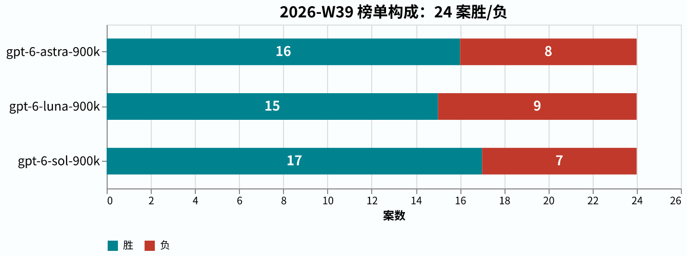
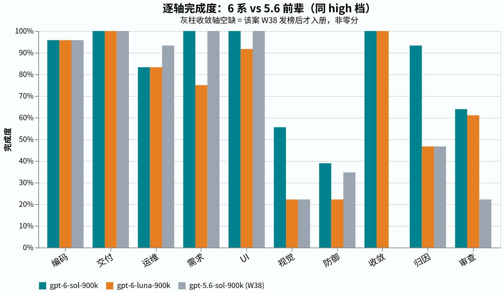
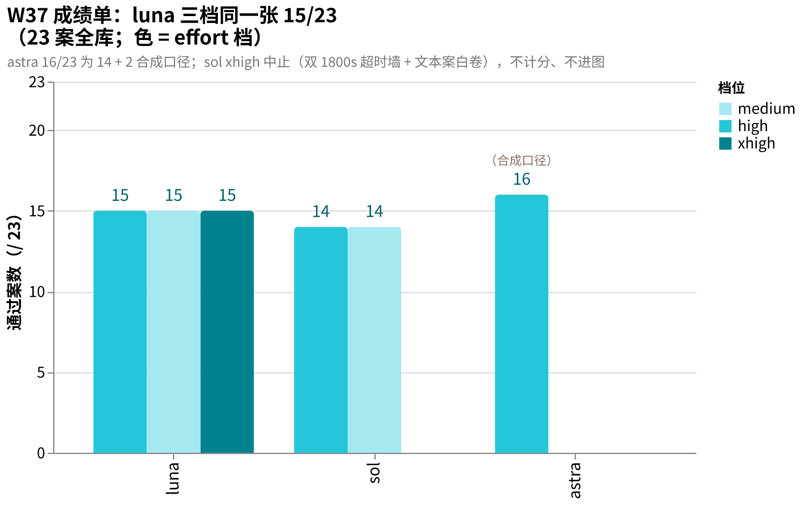
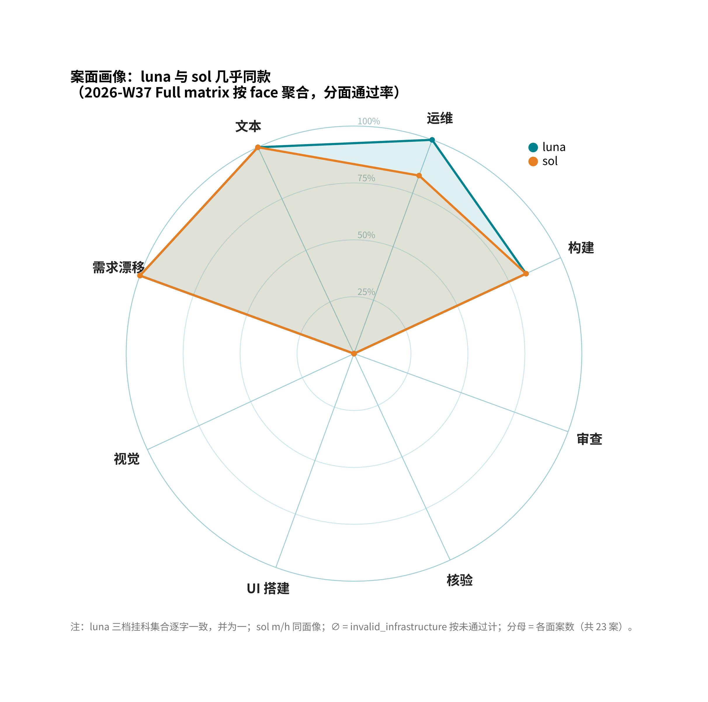
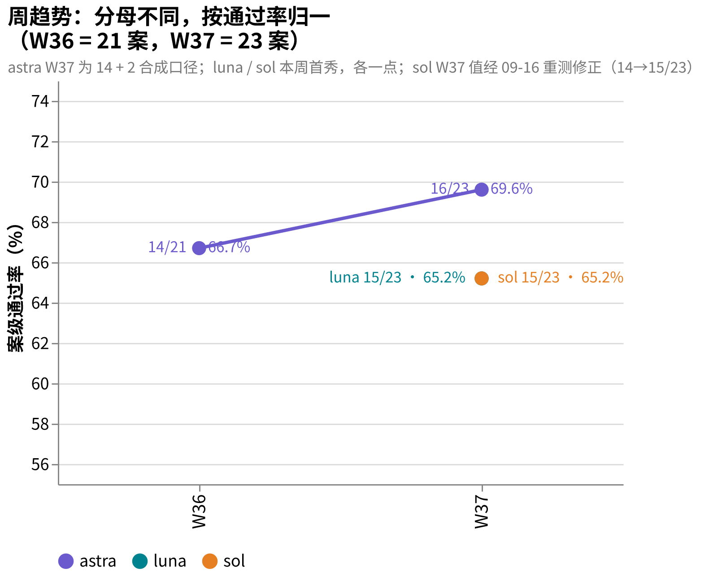
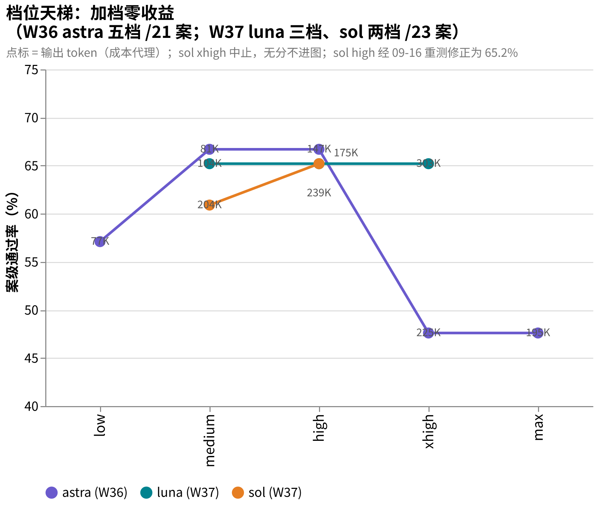

[English](README.en.md) · 简体中文

# amber-gpt

> **2026-10-07 更新（另一项）**：A-24bcf707：判分要求被指认的移除提交必须在功能自身的文件里删除了代码行；题面要的是功能被移除或丢失的那个提交，没有写这一要求。只在这一项上没过的车道改记 NA（挂起）而不记负；总过案数不变。见 amber 规范仓 2026-10-07 更正（[链接](https://github.com/getaskclaw/amber/blob/main/docs/corrections-2026-10-07-a-24bcf707.md)）。受影响的车道：gpt-6-astra-900k、gpt-6-sol-900k（W39），gpt-6.1-sol（W40），gpt-6-luna、gpt-6-luna-900k（W41）：成绩一览的运维行已更新（运维格多 1 个 NA），各车道总分不变；下面一句话摘要和结果索引里的「零挂起」「丢 2 案」「每场唯一的 NA」等说法按此读，逐期细节见 [W39](results/2026-W39.md)、[W40](results/2026-W40.md)、[W41](results/2026-W41.md) 页首的更新。

> ⚠️ **更正（2026-10-02，另一项）**：防御轴的一案 A-d511f9e8 在所有车道上改记 NA（考场判的不是考生交付的文件，判分还要求了题面没写的事）。分母不变，**过案数不变**，每条道的总分都带 `'`。本仓各期成绩表里这一格请按 NA 读，其余内容保留原样，以[更正声明](https://github.com/getaskclaw/amber/blob/main/docs/corrections-2026-10-02-a-d511f9e8.md)为准。

> 5.6-luna 展示更正：W37 high 基线加 W39 同档补测；16'/24 = 16 胜 · 4 负 · 4 挂起。首次公开三案 exonerated_infra 改判、能力分暂停采用；A-ea80d793 维持挂起。见 [更正](results/2026-W38-correction-luna-high.md)。GPT-6 成绩不动。 ' = contested（安全拒答挂起）或 invalid（基建相关（考场 harness 或判分环境）的挂起、作废或待重评），均不计胜负；所有含 NA 的道都带撇号，包括冻结展示行；挂起不表示死因已定。

> **2026-10-07 更新**：下面「图说数据」里 W39 逐轴对拍一条写的「视觉 ≥ 2 才算过线」是不精确的简写：视觉案不只看找茬分，同样是找茬分 2，有的场次过、有的场次不过。原句保留不改，详见 [W39](results/2026-W39.md) 和 [W40](results/2026-W40.md) 页首的 2026-10-07 更新。

用私有题库 **AMBER** 每周实测 GPT 系模型（含不同推理档位），只公开结果，不公开题目。

## 成绩一览

<!-- scoreboard:start -->

| 大类 | 轴 | 考什么 | gpt-5.6-luna · [W41](results/2026-W41.md) | gpt-5.6-luna-900k · [W41](results/2026-W41.md) | gpt-6-luna · [W41](results/2026-W41.md) | gpt-6-luna-900k · [W41](results/2026-W41.md) | gpt-6.1-sol · [W40](results/2026-W40.md) | gpt-6-sol-900k · [W39](results/2026-W39.md) | gpt-6-astra-900k · [W39](results/2026-W39.md) | gpt-5.6-sol-900k (high 档) · [W38](results/2026-W38.md) | gpt-5.6-luna-900k (high 档) · [W37](results/2026-W37.md) |
|---|---|---|:-:|:-:|:-:|:-:|:-:|:-:|:-:|:-:|:-:|
| 施工面 | 编码 | 照着需求把功能写对 | 5/6 | 5/6 | 5/6 | 5/6 | 5/6 | 5/6 | 5/6 | 5/6 | 5/6 |
|  | 交付 | 做完还得交得出东西 | 3/3 | 3/3 | 3/3 | 3/3 | 3/3 | 3/3 | 2/3 | 3/3 | 3/3 |
|  | 运维 | 照规程干脏活 | 5/6 | 5/6 | 5/6 · 1 NA | 5/6 · 1 NA | 4/6 · 1 NA | 5/6 · 1 NA | 5/6 · 1 NA | 5/6 | 6/6 |
|  | 需求 | 客户要 A 不要 B | 1/1 | 0/1 | 0/1 | 0/1 | 1/1 | 1/1 | 1/1 | 1/1 | 1/1 |
|  | 收敛 | 真干完，不绕圈装忙 | 1/1 | 1/1 | 1/1 | 1/1 | 1/1 | 1/1 | 1/1 | — | 1/1 |
| 判断面 | UI | 照设计稿做页面 | 1/1 | 1/1 | 1/1 | 0/1 | 1/1 | 1/1 | 0/1 | 1/1 | 0/1 · 1 NA |
|  | 视觉 | 给真截图挑毛病 | 0/1 | 0/1 | 0/1 | 0/1 | 0/1 | 0/1 | 1/1 | 0/1 · 1 NA | 0/1 · 1 NA |
|  | 防御 | 堵死校验器的漏网口 | 0/2 · 1 NA | 0/2 · 1 NA | 0/2 · 1 NA | 0/2 · 1 NA | 0/2 · 1 NA | 0/2 · 1 NA | 0/2 · 1 NA | 0/2 · 1 NA | 0/2 · 1 NA |
|  | 归因 | 毛病对到正确根因 | 0/1 | 0/1 | 0/1 | 0/1 | 0/1 | 0/1 | 0/1 | 0/1 | 0/1 |
|  | 审查 | 给别人的交付物挑错 | 1/2 | 1/2 | 1/2 | 1/2 | 1/2 | 1/2 | 1/2 | 0/2 · 2 NA | 0/2 · 2 NA |
|  | **合计** |  | **17'/24** | **16'/24** | **16'/24** | **15'/24** | **16'/24** | **17'/24** | **16'/24** | **15'/23** | **16'/24** |

每格 = 过了几案/该轴共几案（案 = 一道计分题）。NA = 这一案作废或暂停计分，不算过也不算没过；总分带 `'` 表示其中有 NA。多数轴只有 1–2 案，差一案读数就变，所以别把小差距当结论。各期考试日期不同，数字是当期快照。

<!-- scoreboard:end -->

## 这是什么

- 「道」= 同一个模型名在不同家的卖场/接口；「案」= 一道题，「卷」= 一场考试记录（一案多卷 = 一道题的几个变体场次）。

- 每周一期 `results/YYYY-Www.md`：同题、同 harness（跑考试并记分的程序），对目标模型跑全库；同模型不同 effort 档（思考力度档位）位并排。
- 一期固定报告：题集规模与哈希、每案找茬分（d2 分，我们的打分，算法不公开）与通过/失败、终端终态（程序跑完时的退出状态）、token 用量与时延、环境指纹、按证据纪律写的定性裁决。
- 题目、oracle（判分器）、transcript（答题全过程记录）、中间产物**永不公开**（见下「发布纪律」）。
- 姐妹仓：[amber-crof](https://github.com/getaskclaw/amber-crof)（CrofAI 周测）、[amber-ollama](https://github.com/getaskclaw/amber-ollama)（Ollama Cloud 周测）、[amber-devin](https://github.com/getaskclaw/amber-devin)（Devin 周测）、[amber-deepseek](https://github.com/getaskclaw/amber-deepseek)（DeepSeek 官方道）、[amber-commandcode](https://github.com/getaskclaw/amber-commandcode)（CommandCode 道）、[amber-opencode](https://github.com/getaskclaw/amber-opencode)（OpenCode Go 道）、[amber-workbuddy](https://github.com/getaskclaw/amber-workbuddy)（WorkBuddy ACP 道）、[amber-doubao](https://github.com/getaskclaw/amber-doubao)、[amber-goldenpotato](https://github.com/getaskclaw/amber-goldenpotato)、[amber-kimi](https://github.com/getaskclaw/amber-kimi)、[amber-stepfun](https://github.com/getaskclaw/amber-stepfun)、[amber-claude](https://github.com/getaskclaw/amber-claude)（Claude 道：claude-opus-5-5、claude-sonnet-5-5、claude-fable-5-1）。
- AMBER 是 agentic 实战题库（施工/运维/审查/视觉/需求漂移——题中要求中途变化），规范与制题工具见 [getaskclaw/amber](https://github.com/getaskclaw/amber)；考题本体私有。

## 发布纪律（红线）

1. 只发：分数与聚合、token 用量、速度、定性裁决。
2. 永不发：题目内容、oracle/判分器、transcript、考生工作区、任何能复原题面的中间产物。
3. 每期必钉：模型 ID、effort 档、日期（UTC）、harness 版本、每案内容哈希（bundle_sha，每题内容的哈希指纹）。哈希用于对照 [amber](https://github.com/getaskclaw/amber) 的公开哈希清单，自证题集未变。
4. 案号与题目结构属私有面：公开结果里案例只用稳定别名（A-xxxxxxxx，哈希派生）+ bundle 哈希作句柄；内部案号、变体名、题目描述永不出现。
5. 基调：这是社区周测，不是对厂商的攻击。数据说话，措辞克制。

## 一个方法论前提

同名模型、同 provider，两次跑也可能不同分——推理参数、负载、服务端版本都在漂。所以这里的一切结论都带日期与档位，且按周重测。单日数字是快照，不是定律。

## 图说数据

- **本期成绩单**（2026-W41，24 案全库）：四个 luna 模型在同一个隔离考场里依次全库考试（2026-10-06，high 档，串行）——gpt-5.6-luna **17'/24**、gpt-5.6-luna-900k **16'/24**、gpt-6-luna **16'/24**、gpt-6-luna-900k **15'/24**（这一道的第二场，成为表头成绩）；每场唯一的 NA 是 A-d511f9e8。24 案里 20 案四场胜负相同；视觉、防御、归因四场都没有过案；gpt-6-luna-900k 的 UI 案缺一个必交文件，记未过。相邻总分只差一案，各考一次，不据此判断强弱。详见 [W41](results/2026-W41.md)。
  
- **成绩单**（2026-W40，24 案全库）：gpt-6.1-sol 全库首考 **16'/24**，除 A-d511f9e8 外零挂起。与前辈 gpt-6-sol-900k（W39，17'/24）只有运维案 A-8c909d0a 的胜负不同；两场的窗口也不同（272K 对 900K），并列看，不据此判断强弱。视觉、防御、归因没有过案，审查过 1 案。详见 [W40](results/2026-W40.md)。
  
- **成绩单**（2026-W39，24 案全库）：6 系发布次日全库首考——gpt-6-sol-900k **17/24**、gpt-6-astra-900k **16/24**（同日对照）、gpt-6-luna-900k **15/24**；sol 追平跨仓榜首（opus-5.5：17 胜 · 6 负 · 1 案基建作废，见其更正刊，见 [amber-claude W39](https://github.com/getaskclaw/amber-claude/blob/main/results/2026-W39-correction.md)），5.6 时代「luna ≥ sol」的家族规律在 6 系翻转。详见 [W39](results/2026-W39.md)。
  
- **逐轴对拍**（2026-W39）：6 系三兄弟同日 + 5.6 前辈并排——收益在「判官」面（找茬/归因/审查这类挑别人毛病的轴）：归因 0.47→0.93、审查 0.22→0.64（对照 5.6 前辈，0=全错、1=满分）；视觉轴仍是祖传短板（视觉案打分 sol 1.0 / luna −2，≥2 才算过线，两家都没过）。
  
- **本期成绩单**（2026-W37，23 案全库）：luna 三档同一张 15/23，sol 两档 14/23（high 档 09-16 重测平反 UI 案 → **15/23**，见 [W38](results/2026-W38.md)），astra 合成口径 16/23；sol xhigh 中止不进图。
  
- **案面画像**（2026-W37 Full matrix 按 face 聚合）：luna 与 sol 分面通过率几乎重合，唯一差在运维面（A-24bcf707）。注：图为 W37 快照——sol 的 UI 案 09-16 平反，见 [W38](results/2026-W38.md)。
  
- **周趋势**（W36→W37，按通过率 % 归一）：astra 66.7%→69.6%（W37 为合成口径），luna 65.2%、sol 60.9% 本周首秀（sol 09-16 重测修正 65.2%，见 [W38](results/2026-W38.md)）。
  
- **档位天梯**（W36 astra 五档 + W37 luna/sol）：加档零收益——token 最多涨到 2.9 倍，分数不动。09-17 补：luna max 档首考 16/23 看似破平，实为看门狗修复混杂（剔除后 15/23 与 high 打平，reasoning 397K ≈ high 2.6 倍），零收益结论成立（图未含 max 点，见 [W38 Addendum 4](results/2026-W38.md)）。
  

## 结果索引

| 期 | 内容 | 结论 |
|---|---|---|
| [2026-W36](results/2026-W36.md) | gpt-6-astra-900k 五档（low→max）全库 | 不单调：12→14→14→10→10;medium 是甜点，xhigh/max 反噬；顶档 UI 案零交付 |
| [2026-W37](results/2026-W37.md) | gpt-5.6-luna-900k 三档 + gpt-5.6-sol-900k 两档（23 案新库）；astra 裸 base 补考 2 新案（addendum） | luna 三档同分同名单（15/23），effort 零收益，xhigh=2.9x 纯浪费；sol 无一档赢 luna;xhigh 超时墙再现顶档反噬；astra 补考全过→合成 16/23（-900k 变体已被收回，口径混合已标注）。Addendum 3（09-16）：sol 重测平反 UI 案 → 15/23 |
| [2026-W38](results/2026-W38.md) | gpt-5.6-sol-900k @ high 全库降智复测（对拍 W37） | 零能力回退：22/23 案过挂一致，hard 区分器 7/7 依旧；唯一变化=UI 案平反（客户端看门狗误杀，补考 12/12 满分）→ **15/23**，第四家该案满分车道；luna 同案疑似同冤（未复测）；上游 hermes-agent#112909。Addendum 4（09-17）：luna max 档首考 **16/23** 档梯最满——但 +1 案（UI 案 12/12 首交付）与 09-16 看门狗修复同日混杂，剔除后实为 15/23 与 high 打平，「effort 零收益」成立（reasoning 397K ≈ high 2.6 倍）；视觉案 5.0 刷已发布历史最高；归因案 14/15→7/15 顶档反噬同型再现 |
| [2026-W38 更正特刊](results/2026-W38-correction.md) | W38 全库复核:本仓改判 12 格 · 挂起 14 格 | W36 astra max/xhigh 8 格平反(公开旧值应改钩);W37 luna/sol 14 格挂起;W38 Add4 1 格 + sol 复测 3 格平反 |
| [5.6-luna high 展示更正](results/2026-W38-correction-luna-high.md) | W37 high 基线 2026-09-07 + W39 high 补测 2026-09-21 | 16'/24：16 胜 · 4 负 · 4 挂起；UI／视觉／审查 NA；十轴只用 high，不再混 max |
| [2026-W39](results/2026-W39.md) | gpt-6-sol-900k + gpt-6-luna-900k @ high 全库首考 + gpt-6-astra-900k 同日对照（24 案，6 系首发次日） | sol **17/24** 追平跨仓榜首 opus-5.5；astra 同日对照 16/24（双跑对零翻转）；luna 15/24；家族规律「luna≥sol」在 6 系翻转；收益在判官面（归因 0.47→0.93、审查 0.22→0.64），视觉轴仍是短板（1.0 / −2 均未过线）；harness 起焊死验脑硬闸 |
| [2026-W40](results/2026-W40.md) | gpt-6.1-sol @ high 全库首考（24 案，2026-10-02） | **16'/24**，除 A-d511f9e8 外零挂起；与 gpt-6-sol-900k（W39，17'/24）只有运维案 A-8c909d0a 的胜负不同，窗口 272K 对 900K，并列看，不据此判断强弱；视觉、防御、归因没有过案，审查过 1 案；镜像 v2 加 PyYAML，品牌题单题关考卷闸 |
| [2026-W41](results/2026-W41.md) | gpt-5.6-luna、gpt-5.6-luna-900k、gpt-6-luna、gpt-6-luna-900k @ high 全库（24 案，2026-10-06，隔离考场，串行） | **17'/24、16'/24、16'/24、15'/24**，每场唯一的 NA 是 A-d511f9e8；前三个是新道，gpt-6-luna-900k 是已有道的第二场（W39 为首场，考场不同，不逐格对比）；24 案里 20 案四场胜负相同，视觉、防御、归因没有过案；gpt-6-luna-900k 的 UI 案缺一个必交文件；成绩一览里另有一行老的 `gpt-5.6-luna-900k (high 档)`（W37 基线），与本期新道不是同一道；相邻总分只差一案，各考一次，不据此判断强弱 |

## 免责

与 OpenAI 无任何隶属/赞助关系。分数是特定周、特定档位的快照，不构成采购建议。
