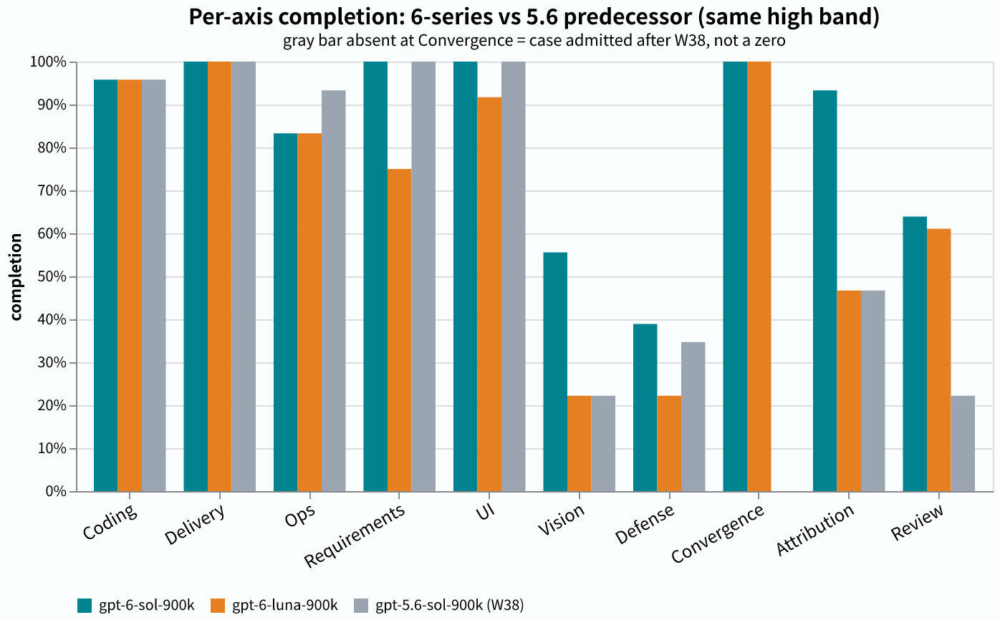

# 2026-W39 — GPT-6 Sol / Luna / Astra first full run (day after the 6-series launch)

> Reference correction: the cited Claude result is 17 wins · 6 losses · 1 case void due to infrastructure, not a clean 17/24. See [Claude correction](https://github.com/getaskclaw/amber-claude/blob/main/results/2026-W39-correction.en.md). GPT-6 scores below are unchanged.

gpt-6-sol-900k **17/24** · gpt-6-astra-900k **16/24** (same-day control) · gpt-6-luna-900k **15/24** — case-level scoring (a case counts only if every pin is green).

OpenAI shipped two 6-series sub-models (Sol / Luna) on 2026-09-22. The next day we ran both through the full AMBER library (24 cases / 27 runs) at high band — with astra-900k, the 6-series incumbent, as a same-day control leg (recycled from the incident in Finding 7; the data is valid). Headline: **Sol ties the current cross-repo leader opus-5.5 at 17/24 (cross-repo reference, see [amber-claude W39](https://github.com/getaskclaw/amber-claude/blob/main/results/2026-W39.md)); Luna lands at 15/24 — the 5.6-era family pattern "luna ≥ sol" flips in the 6 series.**

## Run identity

| field | value |
|---|---|
| models | `gpt-6-sol-900k` · `gpt-6-luna-900k` (plus same-day control leg `gpt-6-astra-900k`, two runs) |
| provider | OpenAI codex subscription lane |
| band | high |
| window (UTC) | 2026-09-23 05:27 → ~07:55 (sol ≈ 65 min, luna ≈ 57 min) |
| harness | bench-astra-high.py `217be3c6` (brain-consistency gate hard-wired: declared model ≠ the model actually seated ('brain') → refuse to run) |
| verification | wire probe 54/54; all 54 ledger rows carry the declared brain; quota-window defer switch active |
| case set | 24 cases / 27 runs · [hash-index v2026-09](https://github.com/getaskclaw/amber/blob/main/hash-index/v2026-09.md) |
| scoring | case = all pins green (a 'pin' is one checkpoint inside a case; a case passes only when every pin is green); review rows take score (review ≥ 3, vision ≥ 2) |
| cost | subscription lane, no marginal price; per-leg burn ≈ in 2.2M / out 0.26M tokens; weekly quota window 4% → 18% |

## Full matrix

| case | face | bundle | gpt-6-sol-900k | gpt-6-luna-900k | gpt-6-astra-900k (same-day control) | predecessor gpt-5.6-sol-900k (W38, same high band) |
|---|---|---|---|---|---|
| A-13854d9d | text | `a56b202b0537` | ✓ 5/5 | ✓ 5/5 | ✗ 0/5 | ✓ 5/5 |
| A-1fd3683a | text | `6a980035b42f` | ✓ 2/2 | ✓ 2/2 | ✓ 2/2 | ✓ 2/2 |
| A-791e90ac | text | `0396c8576a56` | ✓ 6/6 | ✓ 6/6 | ✓ 6/6 | ✓ 6/6 |
| A-442d4aab | build | `ddf28dfda1cd` | ✓ 7/7 | ✓ 7/7 | ✓ 7/7 | ✓ 7/7 |
| A-569dbe0d | build | `45ccf06657af` | ✓ 10/10 | ✓ 10/10 | ✓ 10/10 | ✓ 10/10 |
| A-61f7ad01 | build | `991167b1455f` | ✓ 7/7 | ✓ 7/7 | ✓ 7/7 | ✓ 7/7 |
| A-641195e2 | build | `7cc76bad6f89` | ✓ 8/8 | ✓ 8/8 | ✓ 8/8 | ✓ 8/8 |
| A-77d62143 | build | `7edee286f327` | ✓ 8/8 | ✓ 8/8 | ✓ 8/8 | ✓ 8/8 |
| A-87c472cb | build | `cd643fa107e0` | ✗ 6/8 | ✗ 6/8 | ✗ 6/8 | ✗ 6/8 |
| A-a317e74b | verify | `e05970e7d7c9` | ✗ 14/15 | ✗ 7/15 | ✗ 14/15 | ✗ 7/15 |
| A-be92627f | verify | `6593829abdfa` | ✗ 4/9 | ✗ 1/9 | ✗ 4/9 | ✗ 4/9 |
| A-d511f9e8 | verify | `f725082a2dc8` | ✗ 4/12 | ✗ 4/12 | ✗ 4/12 | ✗ 3/12 |
| A-47eea242 | review | `b4b8d4bb44e3` | ✓ | ✓ | ✓ | ✗ -2 |
| A-cdc3d11a | review | `dbb207a3118d` | ✗ -0.5 | ✗ -1 | ✗ -6 | ✗ -2 |
| A-ea80d793 | vision | `1d69841b029e` | ✗ 1.0 | ✗ -2.0 | ✓ | ✗ -2 |
| A-0676097b | req-drift | `3c04bb80fe94` | ✓ 4/4 | ✗ 3/4 | ✓ 4/4 | ✓ 4/4 |
| A-24bcf707 | ops | `ba4431d40006` | ✗ | ✗ | ✗ | ✗ 3/5 |
| A-6fbeb363 | ops | `bcfb57e27cff` | ✓ | ✓ | ✓ | ✓ |
| A-8c909d0a | ops | `53623441d653` | ✓ | ✓ | ✓ | ✓ |
| A-8d4bc770 | ops | `957f29e633c7` | ✓ | ✓ | ✓ | ✓ |
| A-984e80ee | ops | `a28b57d4d1f1` | ✓ | ✓ | ✓ | ✓ |
| A-a5608487 | ops | `bcfac8de9f29` | ✓ | ✓ | ✓ | ✓ |
| A-d9b79b46 | ui-build | `d6d63130ecc6` | ✓ 12/12 | ✗ 11/12 | ✗ | **✓ 12/12** |
| A-3f2a9cdd | convergence | `4880adbea261` | ✓ | ✓ | ✓ | — |
| **total** | | | **17/24** | **15/24** | **16/24** | 15/23 |

The astra column is a same-day, same-library, same-harness control (the day's double-run pair r1/r2 had identical pass/fail sets; only the `A-cdc3d11a` degree differs, −6 vs −1 — r1 shown). The predecessor column is reference-only: W38 used the 23-case library (the convergence case `A-3f2a9cdd` was not yet admitted) and includes adjudication corrections; its total is not directly comparable to this week's 24-case headline.

## Per-axis completion

## A note on the axis profile

Per-axis data is in the grouped-bar chart above. This issue originally shipped a ten-axis radar chart; it was withdrawn on reader feedback — without a radial scale it made failing axes look passing, and polygon area exaggerates the true margin. The PNG stays at `assets/2026-W39-radar.en.png` for the record.

## Findings

1. **Sol ties the top without brute force:** inside the 17/24, the attribution axis jumps 0.47 → 0.93 and review 0.22 → 0.64 (vs the 5.6 predecessor). The gains come from the judge faces, not the build faces — coding and delivery were already near-saturated (0.96 / 1.0) for all three.
2. **Family pattern flips:** in the 5.6 era luna ≥ sol (W37 debut: luna 15/23 vs sol 14/23, later tied at 15/23 after a reversal); in the 6 series sol 17 > luna 15, with luna behind on requirements, UI, attribution, and review.
3. **Vision is still the 6-series heirloom weakness:** sol 1.0, luna −2 — neither passes (≥ 2 required). It failed in 5.6 too and was not fixed this generation. Don't send 6-series to screenshot-review work.
4. **Ops axis regresses slightly:** both at 0.83 vs the predecessor's 0.93 (axis value = mean of per-case normalized scores, computed from manifests), concentrated on one case `A-24bcf707` — the predecessor failed that same case (3/5), so it reads as a genuinely hard case rather than a capability loss; logged, no verdict.
5. **Infra transparency:** sol's UI case (`A-d9b79b46`) was first marked invalid because the oracle lacked its browser binary; after the fix we **re-judged in place** (re-ran the judge only, appended a correction row to the manifest, no re-exam), moving sol from 16/24 to 17/24. Luna's leg started after the browser was in place and was unaffected.
6. **Same-day reproducibility:** astra-900k was accidentally examined twice that day (the wrong-brain incident, see below) — both legs scored 16/24 with identical pass/fail sets and only one degree difference. Case noise exists; case-level conclusions reproduce.
7. **Guardrail upgrade:** from this run the harness hard-fails when the declared brain differs from the profile brain (`217be3c6`) — the earlier batch burned 54 runs on the wrong brain due to a wrapper missing the model variable (its output is the same-day control column above; kept because the data is valid); that incident has a postmortem, and this run was the re-take under the new gate.

中文: [2026-W39.md](2026-W39.md)
