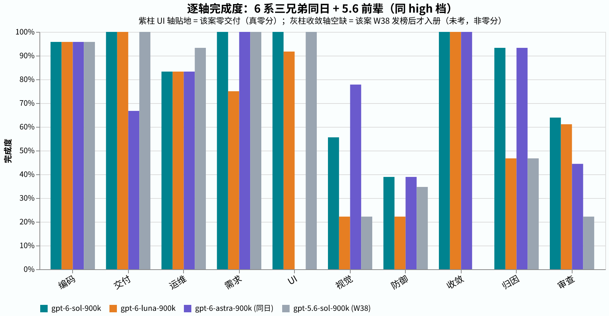

# 2026-W39 — GPT-6 Sol / Luna 全库首考（OpenAI 6 系首发日）

gpt-6-sol-900k **17/24** · gpt-6-astra-900k **16/24**（同日对照）· gpt-6-luna-900k **15/24** — 案口径（一个案子要么全钉绿，要么算输）。

OpenAI 在 2026-09-22 放出 6 系两款子型号（Sol / Luna）。发次日我们让它们在 AMBER 全库（24 案 / 27 卷）各跑了一遍 high 档——6 系在役老面孔 astra-900k 同日作对照腿。结论先行：**Sol 以 17/24 追平目前的跨仓榜首 opus-5.5（引用列，见 [amber-claude W39](https://github.com/getaskclaw/amber-claude/blob/main/results/2026-W39.md)）；Luna 15/24 明显落在后面——5.6 时代「luna ≥ sol」的家族规律在 6 系翻转了。**

## 场次身份

| 项 | 值 |
|---|---|
| models | `gpt-6-sol-900k` · `gpt-6-luna-900k`（+ 同日对照腿 `gpt-6-astra-900k` ×2 跑） |
| provider | OpenAI codex 订阅道 |
| band | high |
| window (UTC) | 2026-09-23 05:27 → ~07:55（sol 约 65 min，luna 约 57 min） |
| harness | bench-astra-high.py `217be3c6`（本轮起焊死 brain-consistency 闸：声明脑 ≠ profile 脑即拒跑） |
| 验证口径 | wire probe 54/54；两腿 54 卷账本全为声明脑；撞墙配额 defer 开关在场 |
| case set | 24 案 / 27 卷 · [hash-index v2026-09](https://github.com/getaskclaw/amber/blob/main/hash-index/v2026-09.md) |
| scoring | 案 = 全钉绿才胜；开放行数钉；审查行看分（review ≥ 3，vision ≥ 2） |
| cost | 订阅道无边际价；卷均烧 token ≈ in 2.2M / out 0.26M per 腿；订阅周窗 4% → 18% |

## 全案矩阵

| case | face | bundle | gpt-6-sol-900k | gpt-6-luna-900k | gpt-6-astra-900k（同日对照） | 前辈 gpt-5.6-sol-900k（W38，同 high 档） |
|---|---|---|---|---|---|
| A-13854d9d | text | `a56b202b0537` | ✓ 5/5 | ✓ 5/5 | ✗ 0/5 | ✓ 5/5 |
| A-1fd3683a | text | `6a980035b42f` | ✓ 2/2 | ✓ 2/2 | ✓ 2/2 | ✓ 2/2 |
| A-791e90ac | text | `0396c8576a56` | ✓ 6/6 | ✓ 6/6 | ✓ 6/6 | ✓ 6/6 |
| A-442d4aab | build | `ddf28dfda1cd` | ✓ 7/7 | ✓ 7/7 | ✓ 7/7 | ✓ 7/7 |
| A-569dbe0d | build | `45ccf06657af` | ✓ 10/10 | ✓ 10/10 | ✓ 10/10 | ✓ 10/10 |
| A-61f7ad01 | build | `991167b1455f` | ✓ 7/7 | ✓ 7/7 | ✓ 7/7 | ✓ 7/7 |
| A-641195e2 | build | `7cc76bad6f89` | ✓ 8/8 | ✓ 8/8 | ✓ 8/8 | ✓ 8/8 |
| A-77d62143 | build | `7edee286f327` | ✓ 8/8 | ✓ 8/8 | ✓ 8/8 | ✓ 8/8 |
| A-87c472cb | build | `cd643fa107e0` | ✗ 6/8 | ✗ 6/8 | ✗ 6/8 | ✗ 6/8 |
| A-a317e74b | verify | `e05970e7d7c9` | ✗ 14/15 | ✗ 7/15 | ✗ 14/15 | ✗ 7/15 |
| A-be92627f | verify | `6593829abdfa` | ✗ 4/9 | ✗ 1/9 | ✗ 4/9 | ✗ 4/9 |
| A-d511f9e8 | verify | `f725082a2dc8` | ✗ 4/12 | ✗ 4/12 | ✗ 4/12 | ✗ 3/12 |
| A-47eea242 | review | `b4b8d4bb44e3` | ✓ | ✓ | ✓ | ✗ -2 |
| A-cdc3d11a | review | `dbb207a3118d` | ✗ -0.5 | ✗ -1 | ✗ -6 | ✗ -2 |
| A-ea80d793 | vision | `1d69841b029e` | ✗ 1.0 | ✗ -2.0 | ✓ | ✗ -2 |
| A-0676097b | req-drift | `3c04bb80fe94` | ✓ 4/4 | ✗ 3/4 | ✓ 4/4 | ✓ 4/4 |
| A-24bcf707 | ops | `ba4431d40006` | ✗ | ✗ | ✗ | ✗ 3/5 |
| A-6fbeb363 | ops | `bcfb57e27cff` | ✓ | ✓ | ✓ | ✓ |
| A-8c909d0a | ops | `53623441d653` | ✓ | ✓ | ✓ | ✓ |
| A-8d4bc770 | ops | `957f29e633c7` | ✓ | ✓ | ✓ | ✓ |
| A-984e80ee | ops | `a28b57d4d1f1` | ✓ | ✓ | ✓ | ✓ |
| A-a5608487 | ops | `bcfac8de9f29` | ✓ | ✓ | ✓ | ✓ |
| A-d9b79b46 | ui-build | `d6d63130ecc6` | ✓ 12/12 | ✗ 11/12 | ✗ | **✓ 12/12** |
| A-3f2a9cdd | convergence | `4880adbea261` | ✓ | ✓ | ✓ | — |
| **total** | | | **17/24** | **15/24** | **16/24** | 15/23 |

astra 列 = 同日同库同 harness 对照（当日双跑对 r1/r2 过挂集合完全一致，仅 `A-cdc3d11a` 程度差 −6/−1，取 r1）；前辈列只作参照：W38 用的是 23 案库（收敛案 `A-3f2a9cdd` 当时未入册），且含裁判更正；不可与本周 24 案口径直接比总数。

## 逐轴完成度对拍

## 十轴画像

## Findings

1. **Sol 追平榜首，但不靠蛮力：** 17/24 的构成里，归因轴从 0.47 跳到 0.93、审查轴从 0.22 跳到 0.64（对照 5.6 前辈），收益主要来自「判官」面而不是施工面——编码/交付两轴两家本来就满。
2. **家族规律翻转：** 5.6 时代 luna ≥ sol（W36/W37 均是 luna 略优），6 系变成 sol 17 > luna 15；luna 在需求、UI、归因、审查四轴全面落后。
3. **视觉轴仍是 6 系祖传短板：** sol 1.0、luna −2，两家都没过线（≥2 才算过）；5.6 时代就挂，这一代没修。看图审 bug 的场景仍不建议派 6 系。
4. **运维轴小幅回退：** 两家 0.83 < 前辈 0.93，挂点在同一案上，疑似题库敏感而非能力差，先记录不展开。
5. **基建透明条：** sol 腿的 UI 案（`A-d9b79b46`）首判时 oracle 缺浏览器二进制被判 invalid，修复后按规矩**原地重评**（只重跑判官不重考，manifest 追加修正行），由 16/24 改为 17/24。luna 腿开考时浏览器已在位，不受影响。
6. **同日复现性：** astra-900k 当天被意外连考两场（错脑事故，见下条），两腿 16/24 且过挂集合完全一致、仅一格程度差——单案噪声存在，案级结论可复现。
7. **防呆升级：** 本场起 harness 焊死「声明脑 ≠ profile 脑即拒跑」的硬闸（`217be3c6`）——前一场次曾因 wrapper 漏传模型名把 54 卷考错脑（废料即上方的同日对照腿，数据有效故保留），该事故有复盘档，本场即带着新闸重考。

English: [2026-W39.en.md](2026-W39.en.md)
